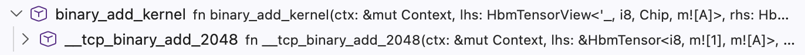
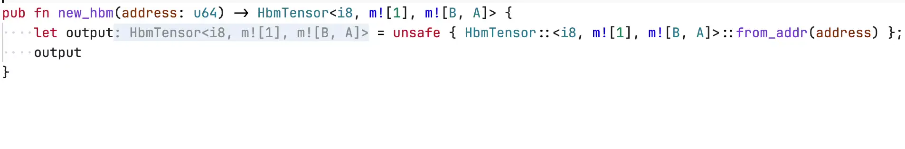
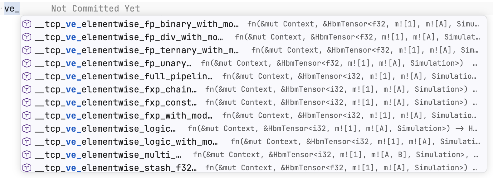
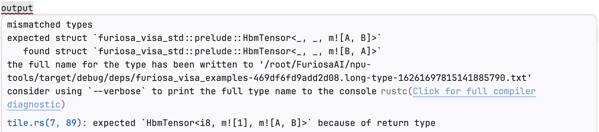
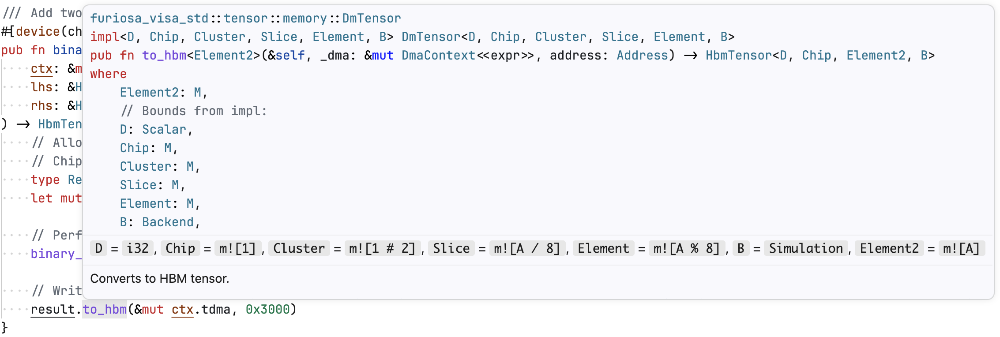
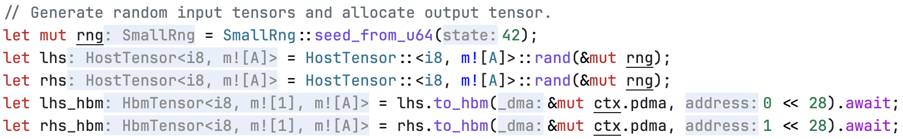
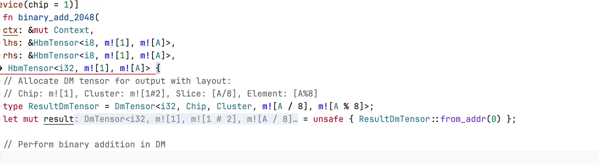

# 언어 서버

이 부록은 매핑 표현식에 대한 IDE 지원을 제공하는 `rust-analyzer` 프록시 `furiosa-rust-analyzer-proxy` 의 설치와 설정을 다룬다.
이 프록시는 내부에서 `rust-analyzer` 를 실행해 일반적인 Rust 언어 서버 트래픽을 그쪽으로 전달하고, 에디터에 보이는 결과를 다시 써서 매핑 타입이 `m![...]` 표기로 표시되게 한다.

## 설치

1. [`rust-analyzer`](https://rust-analyzer.github.io/book/rust_analyzer_binary.html) 가 설치되어 있고 `PATH` 에서 찾을 수 있는지 확인한다.
   프록시는 표준 Rust IDE 기능을 제공하기 위해 이 업스트림 `rust-analyzer` 프로세스를 띄운다.
2. [GitHub 릴리스](https://github.com/furiosa-ai/furiosa-opt/releases/latest) 에서 `furiosa-rust-analyzer-proxy` 바이너리를 내려받고 실행 가능하게 만든다:

   ```bash
   curl -L -o furiosa-rust-analyzer-proxy \
     https://github.com/furiosa-ai/furiosa-opt/releases/latest/download/furiosa-rust-analyzer-proxy-x86_64-unknown-linux-gnu
   chmod +x furiosa-rust-analyzer-proxy
   ```

3. 기본 언어 서버 대신 내려받은 바이너리를 쓰도록 IDE 를 설정한다.
   예를 들어 VSCode 에서는 `settings.json` 을 수정한다:

   ```jsonc
   {
     "rust-analyzer.server.path": "/path/to/furiosa-rust-analyzer-proxy",
     "rust-analyzer.inlayHints.maxLength": null  // recommended to reduce '_' truncation
   }
   ```

## 환경 변수

환경 변수로 언어 서버를 설정할 수 있다.
예를 들어 VSCode 에서는 `settings.json` 을 수정한다:

```jsonc
{
  "rust-analyzer.server.extraEnv": {
    "ENV_NAME": "env_value"
  }
}
```

- `FURIOSA_RUST_ANALYZER_PROXY_UPSTREAM`: 프록시가 띄우는 업스트림 `rust-analyzer` 바이너리의 사용자 지정 경로.
  기본값은 `PATH` 에 있는 `rust-analyzer` 다.

## 기능

프록시는 표준 Rust IDE 기능을 `rust-analyzer` 에 위임하고, 에디터에 보이는 결과의 매핑 표현식을 다시 쓴다.

### 호출 계층

들어오는 호출과 나가는 호출의 계층 뷰를 제공한다.
계층 항목에 표시되는 함수 세부 정보는 매핑 표현식으로 변환된다.



### 코드 액션

빠른 수정, 리팩터, 그 밖의 에디터 액션을 제공한다.
액션 제목과 텍스트 편집은 매핑 표현식으로 변환된다.



### 코드 완성

이름, 메서드, 함수, 타입, 스니펫에 대한 완성 항목을 제공한다.
완성 레이블, 세부 텍스트, 텍스트 편집은 매핑 표현식으로 변환된다.



### 진단

`rust-analyzer` 와 `rustc` 의 진단을 제공한다.
진단 메시지와 관련 정보는 매핑 표현식으로 변환된다.



### 호버

심볼 위에 마우스를 올리면 추가 정보를 보여준다.
추론된 타입, 함수 시그니처, 문서 같은 호버 내용은 매핑 표현식으로 변환된다.



### 인레이 힌트

소스 코드에 인라인으로 추가 정보를 보여준다.
인레이 힌트는 매핑 표현식으로 변환된다.

> [!TIP]
> 가장 정확하게 변환하려면 [`rust-analyzer.inlayHints.maxLength`](https://rust-analyzer.github.io/book/configuration.html#inlayHints.maxLength) 를 `null`(길이 무제한)로 설정한다.
> 이렇게 하면 긴 인레이 힌트가 '_' 로 잘리는 빈도가 줄어든다.



### 시그니처 도움말

호출을 작성하는 동안 함수 시그니처와 현재 매개변수를 보여준다.
시그니처 레이블, 매개변수 레이블, 문서는 매핑 표기를 쓰도록 다시 쓰이며, LSP 클라이언트가 반환하는 오프셋 기반 매개변수 레이블도 포함한다.



## 주의 사항

사용자 정의 타입이 내부 매핑 구성 요소와 이름을 공유하면, 언어 서버가 그 타입을 매핑 표현식으로 잘못 해석할 수 있다.
예를 들어 사용자 정의 `Symbol<T>` 구조체를 정의하면 언어 서버가 IDE 에서 이를 `m![T]` 로 잘못 표시할 수 있다.
이는 순전히 UI 표시 문제이며 다른 LSP 동작에는 영향을 주지 않는다.

