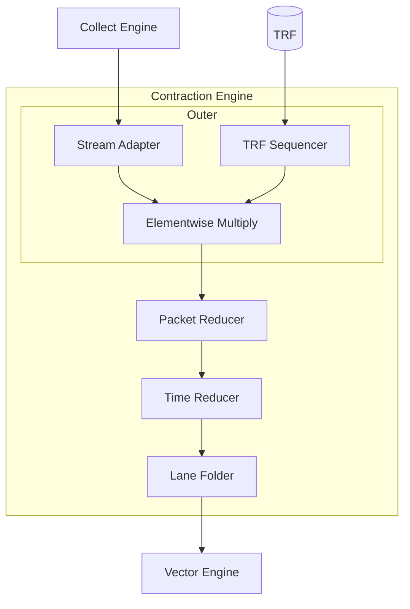

# Contraction Engine

Contraction Engine 은 matmul, convolution 같은 이항 텐서 축약을 수행한다.
[Quick Start](../../quick-start.md) 의 내용을 다시 짚는다.

- 텐서 축약은 입력 텐서 두 개를 받아 공유되는(축약되는) 축을 따라 축약(리듀스)한다.
  Dot product, GEMV, GEMM 이 대표적인 예다.
- 축약은 Broadcast, Multiply, Reduce 세 단계로 분해된다.
- 한 피연산자는 [Collect Engine](../collect-engine.md) 에서 스트리밍되고, 다른 하나는 TRF (Tensor Register File) 에 놓인다.
- 축약은 [main 컨텍스트](../../scheduling.md) 에서 실행된다.
  TRF 준비는 `.to_trf()` 를 통해 sub 컨텍스트에서 실행된다.

## 구조

네 개의 파이프라인 단계가 작업을 나눈다. Broadcast 와 Multiply 에 하나, Reduce 에 셋이다.
각 단계는 서로 겹치지 않는 자기 차원을 담당한다.



- **[Outer](./outer.md)** *(Broadcast 와 Multiply)*: 두 피연산자를 서로 맞는 형태 `[Chip, Cluster, Slice, Lane, Time, Packet]` 로 브로드캐스트한 뒤 원소 단위로 곱해 하나의 곱 텐서로 만든다.
  `Chip` / `Cluster` / `Slice` 는 그대로 통과한다. `Lane` 은 TRF 와 하위 리듀서들이 공유하는 공간 병렬성을 인덱싱한다. `Time` 과 `Packet` 은 함께 [패킷 스트림](../../mapping-tensors/spatial-temporal-dimensions.md) 을 나타낸다.
  세 개의 하위 단계가 직렬로 동작한다. Stream Adapter 가 스트리밍 피연산자를 브로드캐스트하고, TRF Sequencer 가 TRF 피연산자를 브로드캐스트하며, Multiplier 가 축약 출력 타입(`i4`/`i8` -> `i32`, `f8`/`bf16` -> `f32`)으로 확장한 뒤 원소 단위로 곱한다.
- **[Packet Reducer](./packet-reducer.md)** *(`Packet` 안에서 Reduce)*: `Packet` 에 매핑된 축약 축을 병렬 트리로 리듀스하며, 트리는 레인마다 하나씩 있다.
- **[Time Reducer](./time-reducer.md)** *(`Time` 에 걸쳐 Reduce)*: 사이클마다 나오는 결과를 공유 누산기에 누적한다.
- **[Lane Folder](./lane-folder.md)** *(`Lane` 을 Fold)*: 버퍼를 출력 스트림으로 내보내며, 모드에 따라 `Lane` 을 `OutPacket` 또는 `OutTime` 으로 흡수한다.
  슬라이스나 칩에 걸친 리듀스는 하위의 [Vector Engine](../vector-engine/index.md) 이 처리한다.

Outer 단계는 (RNGD 에서) `Lane ≤ 8` 과 `Packet ≤ 64 B` 로 제한한다. 자세한 내용은 [Packet Reducer](./packet-reducer.md) 와 [Time Reducer](./time-reducer.md) 를 참고한다.

네 단계 전부에 Inter-Slice Reducer 까지 쌓은 종단 간 지연 예산(예: 65,536 → 스칼라 1 개를 약 296 사이클에)은 [커널 예제: Chip/Cluster Reduce](../../kernel-examples/chip-cluster-reduce.md) 를 참고한다.

<a id="example-batched-matmul"></a>
## 예제: 배치 MatMul

[Quick Start](../../quick-start.md) 는 dot product, GEMV, GEMM 을 차례로 다룬다.
배치 matmul 은 GEMM 에 선행 배치 축 V 를 더해 확장한 것이다: \\(VMK, KN \rightarrow VMN\\).
V 개의 독립적인 (M × K) 입력 각각과 공유되는 (K × N) 가중치에 대해, 커널은 (M × N) 곱을 만든다.

아래 세 가지 변형은 어떤 축을 `Time` 에 두는지로 커널을 분류한다.
남은 축들은 공간 병렬성으로 활용한다.
세 변형은 다음 축을 공유한다.

```rust
# #![feature(adt_const_params)]
# extern crate furiosa_opt_std;
# use furiosa_opt_std::prelude::*;
axes![V = 32, M = 32, N = 8, K = 32];   // V batch, M×N output, K contraction
```

(별도의 Stream Adapter 기구를 사용하는 또 다른 예제는 [2D Convolution](./2d-convolution.md) 을 참고한다.)


### K 를 Time 에

K (축약 축) 가 `Time` 에 놓인다. M 은 `Cluster` 와 `Slice` 로 나뉘고 V 도 함께 나뉜다. `V % 16` 은 `Slice` 로 가고 `V / 16 = 2` 는 K 와 나란히 `Time` 으로 간다 (RNGD 에서 V × M = 1024 는 칩당 512 개의 공간 셀에 들어가지 않으므로, V 의 바깥 덩어리는 반복해야 한다). `Packet` 은 `1 # 32` 로 패딩되고 리듀스는 Packet Reducer 의 공간 트리 대신 사이클에 걸쳐 순차적으로 진행되므로, 사이클마다 32 개의 곱셈기 중 1 개만 유효한 일을 한다 (bf16 의 경우 MAC 활용률 1/32). 그 결과는 퇴화된 커널이며, 교육용 기준선으로만 제시한다.

```rust
# #![feature(adt_const_params)]
# extern crate furiosa_opt_std;
# use furiosa_opt_std::prelude::*;
axes![V = 32, M = 32, N = 8, K = 32];   // V batch, M×N output, K contraction

type Chip    = m![1];                   // single chip
type Cluster = m![M / 16];              // outer M split across clusters (M / 16 = 2)
type Slice   = m![M % 16, V % 16];      // inner M × inner V = 16 × 16 = 256 slices per cluster
type Lane    = m![N];                   // N (output channels) partitions the 8 hardware lanes

/// Batched matmul with K placed in Time.
fn bmatmul_k_in_time<'l, const T: Tu>(
    // Streaming operand: V outer + K in Time, with a one-element Packet m![1].
    input: CollectTensor<'l, T, bf16, Chip, Cluster, Slice, m![V / 16, K], m![1 # 16]>,
    // TRF operand: N in Lane, K in Element. Stored into TRF by a prior .to_trf() call.
    trf: &TrfTensor<bf16, Chip, Cluster, Slice, Lane, m![K]>,
    // Output: one (M × N) f32 matrix per (slice, V-outer) pair.
) -> ContractTensor<'l, T, f32, Chip, Cluster, Slice, m![V / 16], m![N]> {
    input
         // Outer: Lane = m![N] (inferred from trf), OutTime = m![V / 16, K], OutPacket = m![1 # 32].
         // input: 1 K-element broadcast across all N lanes.
         // trf:   1 K-element per lane, advancing one K-step per cycle.
         .contract_outer::<m![V / 16, K], m![1 # 16], _, _, _>(trf)
         // Packet Reducer: OutPacket = m![1]. Nothing to reduce.
         .contract_packet::<m![1]>()
         // Time Reducer: OutTime = m![V / 16]. K iterates over Time and accumulates; V outer survives.
         .contract_time::<m![V / 16]>()
         // Lane Folder: Lane folds into OutPacket. Interleaved mode emits 8 lanes per cycle.
         .contract_lane::<m![V / 16], m![N]>(LaneMode::Interleaved)
}
# 
# let mut ctx = Context::acquire();
# 
# let a: CollectTensor<'_, _, bf16, Chip, Cluster, Slice, m![V / 16, K], m![1 # 16]> = CollectTensor::new(&mut ctx.main, Tensor::zero());
# let b: TrfTensor<bf16, Chip, Cluster, Slice, Lane, m![K]> = unsafe { TrfTensor::from_addr(TrfAddress::Full) };
# let _o = bmatmul_k_in_time(a, &b);
```

이 병적인 경우를 피하려면 K 를 `Packet` 에 두고(Packet Reducer 의 트리를 통한 병렬 리듀스), 살아남은 축(V, M, N)을 `Cluster`, `Slice`, `Lane` 에 펼쳐 공간 병렬성을 최대화한다.
아래 두 전략은 이 원칙을 적용하며, 단순함을 위해 분류마다 축을 하나씩 두었다. 실제 커널은 크기가 요구하면 축 하나를 여러 분류에 걸쳐 나누기도 한다.

### M 을 Time 에

V (배치) 가 `Cluster` 와 `Slice` 에 분산된다 (슬라이스당 배치 원소 하나). M 은 `Time` 에, K 는 `Packet` 에 놓인다. 이 전략은 (1) 슬라이스 수가 배치를 감당하고, (2) N 이 `Lane` 에 들어가며, (3) K 가 단일 `Packet` 에 들어갈 때 적용할 수 있다. K 가 `Packet` 보다 크면 K 를 `Packet` (공간) 과 `Time` (시간) 으로 나눈다. 레인 전체의 MAC 활용률을 최대화한다.

```rust
# #![feature(adt_const_params)]
# extern crate furiosa_opt_std;
# use furiosa_opt_std::prelude::*;
axes![V = 32, M = 32, N = 8, K = 32];   // V batch, M×N output, K contraction

type Chip    = m![1];                   // single chip
type Cluster = m![V / 16];              // outer V split across clusters (V / 16 = 2)
type Slice   = m![V % 16 # 256];        // inner V split across slices (V % 16 = 16 per cluster)
type Lane    = m![N];                   // N (output channels) partitions the 8 hardware lanes (N = 8 fills the cap)

/// Batched matmul: V slices × (M × K) · (K × N) → V × M × N.
fn bmatmul_m_in_time<'l, const T: Tu>(
    // Streaming operand: M in Time, K in Packet.
    // Element type can be i4, i8, f8, or bf16; integers widen to i32 output, floats to f32.
    input: CollectTensor<'l, T, bf16, Chip, Cluster, Slice, m![M, K / 16], m![K % 16]>,
    // TRF operand: N in Lane (one output channel per lane), K in Element.
    // Stored into TRF by a prior .to_trf() call in the sub context.
    trf: &TrfTensor<bf16, Chip, Cluster, Slice, Lane, m![K]>,
    // Output: one (M × N) f32 matrix per slice.
) -> ContractTensor<'l, T, f32, Chip, Cluster, Slice, m![M], m![N]> {
    input
         // Outer: broadcast input and trf, multiply elementwise.
         // Lane = m![N] (inferred from trf), OutTime = m![M], OutPacket = m![K].
         // input: K elements broadcast across all N lanes.
         // trf:   K elements per lane, broadcast across all M cycles.
         .contract_outer::<m![M], m![K], _, _, _>(trf)
         // Packet Reducer: OutPacket = m![1]. Sum K spatially via the reduction tree.
         .contract_packet::<m![1]>()
         // Time Reducer: OutTime = m![M]. Nothing to reduce.
         .contract_time::<m![M]>()
         // Lane Folder: Lane folds into OutPacket. Interleaved mode emits 8 lanes per cycle.
         .contract_lane::<m![M], m![N]>(LaneMode::Interleaved)
}
# 
# let mut ctx = Context::acquire();
# 
# let a: CollectTensor<'_, _, bf16, Chip, Cluster, Slice, m![M, K / 16], m![K % 16]> = CollectTensor::new(&mut ctx.main, Tensor::zero());
# let b: TrfTensor<bf16, Chip, Cluster, Slice, Lane, m![K]> = unsafe { TrfTensor::from_addr(TrfAddress::Full) };
# let _o = bmatmul_m_in_time(a, &b);
```

### V 를 Time 에

V (배치) 는 `Time` 에, K 는 `Packet` 에 놓인다. M 은 `Cluster` 와 `Slice` 로 나뉜다. 이 전략은 (1) 슬라이스 수가 M 을 감당하고 (`M / 16` 은 `Cluster` 에, `M % 16` 은 `Slice` 에), (2) N 이 `Lane` 에 들어가며, (3) K 가 단일 `Packet` 에 들어갈 때 적용할 수 있다. 배치가 지배적인 축일 때 (예: 배치 추론) 유용하다.

```rust
# #![feature(adt_const_params)]
# extern crate furiosa_opt_std;
# use furiosa_opt_std::prelude::*;
axes![V = 32, M = 32, N = 8, K = 32];   // V batch, M×N output, K contraction

type Chip    = m![1];                   // single chip
type Cluster = m![M / 16];              // outer M split across clusters (M / 16 = 2)
type Slice   = m![M % 16 # 256];        // inner M split across slices (M % 16 = 16 per cluster)
type Lane    = m![N];                   // N (output channels) partitions the 8 hardware lanes

/// Batched matmul with V (batch) placed in Time.
fn bmatmul_v_in_time<'l, const T: Tu>(
    // Streaming operand: V in Time, K in Packet.
    input: CollectTensor<'l, T, bf16, Chip, Cluster, Slice, m![V, K / 16], m![K % 16]>,
    // TRF operand: N in Lane, K in Element. Stored into TRF by a prior .to_trf() call.
    trf: &TrfTensor<bf16, Chip, Cluster, Slice, Lane, m![K]>,
    // Output: one (V × N) f32 matrix per slice.
) -> ContractTensor<'l, T, f32, Chip, Cluster, Slice, m![V], m![N]> {
    input
         // Outer: Lane = m![N] (inferred from trf), OutTime = m![V], OutPacket = m![K].
         // input: K elements broadcast across all N lanes.
         // trf:   K elements per lane, broadcast across all V cycles.
         .contract_outer::<m![V], m![K], _, _, _>(trf)
         // Packet Reducer: OutPacket = m![1]. Sum K spatially via the reduction tree.
         .contract_packet::<m![1]>()
         // Time Reducer: OutTime = m![V]. Nothing to reduce.
         .contract_time::<m![V]>()
         // Lane Folder: Lane folds into OutPacket. Interleaved mode emits 8 lanes per cycle.
         .contract_lane::<m![V], m![N]>(LaneMode::Interleaved)
}
# 
# let mut ctx = Context::acquire();
# 
# let a: CollectTensor<'_, _, bf16, Chip, Cluster, Slice, m![V, K / 16], m![K % 16]> = CollectTensor::new(&mut ctx.main, Tensor::zero());
# let b: TrfTensor<bf16, Chip, Cluster, Slice, Lane, m![K]> = unsafe { TrfTensor::from_addr(TrfAddress::Full) };
# let _o = bmatmul_v_in_time(a, &b);
```
