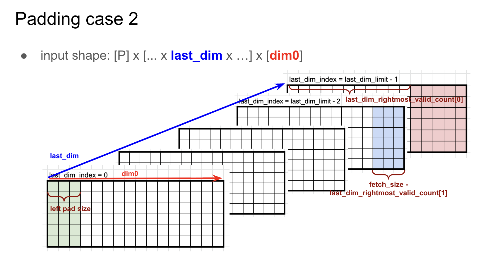

# Fetch Adapter

Fetch Adapter 는 [Fetch Engine](../moving-tensors/fetch-engine.md) 이 내보낸 패킷 스트림에 원소 단위 변환(타입 캐스팅, 마스킹, 테이블 룩업, 제로포인트 감산)을 적용하며, 이는 [Switch Engine](./switch-engine.md) 이 스트림을 슬라이스 전역으로 라우팅하기 전에 일어난다.
Fetch Engine 자체는 이 변환들을 하나도 수행하지 않는다. 이들은 Computing Tensors 아래 이곳에 속하며, Fetch Engine 과 Switch Engine 사이의 별도 단계로 적용된다.
커널 작성자는 단계별 메서드를 `FetchTensor` 위에 직접 이어 붙이고, 각 호출은 다음 단계로 넘어간다.

어댑터는 네 단계를 가지며, 각 단계는 선택적이고 하드웨어 파이프라인 순서대로 스트림에 메서드를 호출해 실행한다.
`FetchTensor` 는 어댑터 호출을 전혀 하지 않고 곧바로 [Switch Engine](./switch-engine.md) 이나 [Collect Engine](./collect-engine.md) 으로 흘러갈 수도 있다.

- [마스킹](#masking) 은 시퀀서의 오른쪽 패드에 해당하는 패딩 슬롯을 0 으로 만든다.
- [테이블 룩업](#table-lookup) 은 하드웨어 룩업 테이블로 값을 치환한다.
- [타입 캐스팅](#type-casting) 은 원소 타입을 변환한다.
- [제로포인트 감산](#zero-point-subtraction) 은 양자화 제로포인트를 빼면서 정수 스트림을 [Contraction Engine](./contraction-engine/index.md) 의 스테이징 타입(`i4` → `i5`, `i8` → `i9`)으로 넓힌다.

[메인 컨텍스트](./index.md#execution-context) 어댑터는 네 단계를 모두 지원하지만, [서브 컨텍스트](./index.md#execution-context) 어댑터는 `fetch_cast` 만 지원한다.


아래 예제는 63 개 원소를 64 로 패딩하고, 64 번째 슬롯을 0 으로 마스킹한 뒤, `i8` → `i32` 로 캐스팅한다.
두 단계는 `fetch()` 가 만든 `FetchTensor` 에 대한 두 번의 메서드 호출로 이어지며, 하드웨어 파이프라인과 일치하는 mask → cast 순서를 따른다.

```rust,ignore
# #![feature(adt_const_params)]
# extern crate furiosa_opt_std;
# use furiosa_opt_std::prelude::*;
axes![A = 63];

fn fetch_mask_then_cast<'l, const T: Tu>(
    input: BeginTensor<'l, T, i8, m![1], m![1], m![1], m![1], m![A]>,
) -> FetchCastTensor<'l, T, i32, m![1], m![1], m![1], m![1], m![A # 64]> {
    input
        .fetch::<m![1], m![A # 64]>()
        //   Time      = m![1]
        //   Packet    = m![A # 64]
        //   OutTime   = m![1]
        //   OutPacket = m![A # 64]    (#{0} cannot yet ride the type, see UC below)
        .fetch_mask::<m![1], m![A # 64]>()
        .fetch_cast::<i32>()
}
#
# let mut ctx = Context::acquire();
# let x: BeginTensor<'_, _, i8, m![1], m![1], m![1], m![1], m![A]> = BeginTensor::new(&mut ctx.main, Tensor::zero());
# let _o = fetch_mask_then_cast(x);
```

<a id="masking"></a>
## 마스킹

Tensor Unit 의 내부 데이터 경로는 고정 폭 단위(32 비트짜리 원소 8 개로 이루어진 32 바이트 flit)로 동작하므로, 크기가 정렬되지 않는 축은 패딩해야 한다(예를 들어 63 은 64 로 올림된다).
`m![A # 64]` 의 패딩 슬롯은 임의의 값을 담고 있어 하위 연산을 오염시킨다.
마스킹은 그 슬롯들을 0 으로 덮어써서 매핑을 `A # 64` 에서 `A #{0} 64` 로 조인다.

```rust,ignore
impl<'l, const T: Tu, P: CanApplyFetchMask, D: Scalar, Chip: M, Cluster: M, Slice: M, Time: M, Packet: M, B: Backend>
    TuTensor<'l, T, P, D, Chip, Cluster, Slice, Time, Packet, B>
{
    /// Runs the Fetch Adapter's masking stage.
    ///
    /// Zeroes the padded slots described by the book chapter. `OutTime`
    /// and `OutPacket` carry the pad-kind change at the type level (e.g.
    /// `m![D # n]` → `m![D #{0} n]`). Callers spell them out explicitly
    /// because downstream methods do not constrain their input shape. This
    /// method takes no runtime argument (see [`FetchMaskConfig`]).
    #[primitive(TuTensor::fetch_mask)]
    pub fn fetch_mask<OutTime: M, OutPacket: M>(
        self,
    ) -> FetchMaskTensor<'l, T, D, Chip, Cluster, Slice, OutTime, OutPacket, B> {
        verify_fetch_mask::<Time, Packet, OutTime, OutPacket>();
        FetchMaskTensor::new(self.ctx, self.inner.transpose(true))
    }
}
```

입력에 붙은 패딩 표기 `# m` 은 출력에서 `#{0} m` 이 된다.
`fetch_mask` 는 런타임 인자를 받지 않는다. 컴파일러가 입력 매핑과 출력 매핑의 차이로부터 마스크 설정(`last_axis`, `valid_count_dim`, `rightmost_valid_count` 를 담는 `FetchMaskConfig`)을 도출한다.


아래 세 사례는 서로 다른 세 가지 시퀀서 레이아웃에서 같은 `B` 축 패턴을 써서, 각 매핑 형태에 대해 컴파일러가 최종적으로 내보낼 설정을 짚어 나간다.


### 연속된 오른쪽 마스크

이 사례는 기본 형태를 보여준다. 연속된 오른쪽 패드 하나가 최내곽 축을 따라 놓이고, DM 텐서의 `B # 96` 은 임의 값을 가진 뒤쪽 슬롯 4 개를 담는다.

```rust,ignore
# #![feature(adt_const_params)]
# extern crate furiosa_opt_std;
# use furiosa_opt_std::prelude::*;
axes![A = 32, B = 92];

fn fetch_mask_contiguous_right<'l, const T: Tu>(
    input: BeginTensor<'l, T, i8, m![1], m![1], m![1], m![1], m![A, B # 96]>,
) -> FetchMaskTensor<'l, T, i8, m![1], m![1], m![1], m![A, B #{0} 96 / 32], m![B #{0} 96 % 32]> {
    input
        .fetch::<m![A, B # 96 / 32], m![B # 96 % 32]>()
        //   Time      = m![A, B # 96 / 32]
        //   Packet    = m![B # 96 % 32]
        //   OutTime   = m![A, B #{0} 96 / 32]   (chunk axis tightens to #{0})
        //   OutPacket = m![B #{0} 96 % 32]      (packet axis inherits #{0})
        .fetch_mask::<m![A, B #{0} 96 / 32], m![B #{0} 96 % 32]>()
}
#
# let mut ctx = Context::acquire();
# let x: BeginTensor<'_, _, i8, m![1], m![1], m![1], m![1], m![A, B # 96]> = BeginTensor::new(&mut ctx.main, Tensor::zero());
# let _o = fetch_mask_contiguous_right(x);
```

아래 그림은 그 의도를 보여준다. 청크 축 `B # 96 / 32` 가 패드를 담고, 마스크가 그 마지막 슬롯 4 개를 0 으로 만든다.


컴파일러는 입력 매핑과 출력 매핑으로부터 다음 시퀀서 루프를 내보낸다(최내곽부터):

```text
[
    B # 96 % 32 = 32 : 1,    // loop 0: packet axis
    B # 96 / 32 = 3 : 32,    // loop 1: chunk axis (carries the pad)
    A = 32 : 96,             // loop 2: outer
] : 32 @ base_addr = 0
```

그런 다음 다음 매개변수로 하드웨어 마스크를 설정한다:

- `last_axis` = 청크 축 `B # 96 / 32` (시퀀서 최적화기가 항목을 병합할 수 있으므로 원시 루프 인덱스가 아니라 축으로 기록한다).
- `valid_count_dim = Rightmost` (`last_axis` 의 최우측 셀만 마스킹된다).
- `rightmost_valid_count = [4, 0, 0, 0, 0, 0, 0, 0]` (최우측 반복의 끝에서 슬롯 4 개가 0 이 된다).

런타임에 하드웨어는 청크 축이 마지막 반복에 이를 때까지 모든 패킷을 손대지 않고 흘려보내다가, 그 마지막 반복에서 마지막 패킷의 뒤쪽 슬롯 4 개를 0 으로 만든다.
따라서 출력 타입은 `B # 96` 에서 `B #{0} 96` 으로 조여진다.

### 분할된 오른쪽 마스크

이 사례는 앞 사례와 같은 오른쪽 패드를 유지하지만, 패딩되지 않은 축이 패딩 영역을 스트림 전체에 걸쳐 분할한다.

```rust,ignore
# #![feature(adt_const_params)]
# extern crate furiosa_opt_std;
# use furiosa_opt_std::prelude::*;
axes![A = 32, B = 92];

fn fetch_mask_split_right<'l, const T: Tu>(
    input: BeginTensor<'l, T, i8, m![1], m![1], m![1], m![1], m![A, B # 96]>,
) -> FetchMaskTensor<'l, T, i8, m![1], m![1], m![1], m![B #{0} 96 / 32, A], m![B #{0} 96 % 32]> {
    input
        .fetch::<m![B # 96 / 32, A], m![B # 96 % 32]>()
        //   Time      = m![B # 96 / 32, A]
        //   Packet    = m![B # 96 % 32]
        //   OutTime   = m![B #{0} 96 / 32, A]
        //   OutPacket = m![B #{0} 96 % 32]   (innermost packet axis tightens)
        .fetch_mask::<m![B #{0} 96 / 32, A], m![B #{0} 96 % 32]>()
}
#
# let mut ctx = Context::acquire();
# let x: BeginTensor<'_, _, i8, m![1], m![1], m![1], m![1], m![A, B # 96]> = BeginTensor::new(&mut ctx.main, Tensor::zero());
# let _o = fetch_mask_split_right(x);
```

아래 그림은 그 의도를 보여준다. 이제 `A` 가 `B # 96 / 32` 와 `B # 96 % 32` 사이에 놓이므로, 패드는 바깥 청크 축이 아니라 최내곽 패킷 축에 자리한다.



컴파일러는 다음 시퀀서 루프를 내보낸다:

```text
[
    B # 96 % 32 = 32 : 1,    // loop 0: packet axis (carries the pad)
    A = 32 : 96,              // loop 1: non-padded axis splits the chunks
    B # 96 / 32 = 3 : 32,    // loop 2: outer chunk axis
] : 32 @ base_addr = 0
```

그런 다음 다음 매개변수로 하드웨어 마스크를 설정한다:

- `last_axis` = 최내곽 패킷 축(이 레이아웃에서 패드를 담는 유일한 축).
- `valid_count_dim = Rightmost` (최외곽 반복의 끝에 있는 셀 하나가 패드를 감당한다).
- `rightmost_valid_count = [4, 0, 0, 0, 0, 0, 0, 0]` (영향받는 패킷마다 슬롯 4 개가 0 이 된다).

최외곽 `B # 96 / 32` 루프가 마지막 반복을 도는 동안, 하드웨어는 내보내는 모든 패킷의 마지막 원소 4 개를 0 으로 만든다.
입력은 `B # 96` 을 유지하고, 마스킹된 반환 타입은 앞 사례와 같은 `B #{0} 96` 이며 Time 축 순서만 다르다.

### 청크별 가변 마스크

이 사례는 청크마다 자기 valid count 를 주어 셀당 상한(4 비트 데이터는 255, `f32` 는 31)을 넘어선다.
DM 텐서의 `B # 128` 은 16 짜리 청크 8 개에 나뉘어 걸친 뒤쪽 패드 슬롯 31 개를 담으므로, 상한만으로는 충분하지 않다.

```rust,ignore
# #![feature(adt_const_params)]
# extern crate furiosa_opt_std;
# use furiosa_opt_std::prelude::*;
axes![A = 32, B = 97];

fn fetch_mask_variable_per_chunk<'l, const T: Tu>(
    input: BeginTensor<'l, T, f32, m![1], m![1], m![1], m![1], m![A, B # 128]>,
) -> FetchMaskTensor<'l, T, f32, m![1], m![1], m![1], m![A, B #{0} 128 / 16, 1], m![B #{0} 128 % 16]> {
    input
        .fetch::<m![A, B # 128 / 16, 1], m![B # 128 % 16]>()
        //   Time      = m![A, B # 128 / 16, 1]
        //   Packet    = m![B # 128 % 16]
        //   OutTime   = m![A, B #{0} 128 / 16, 1]
        //   OutPacket = m![B #{0} 128 % 16]
        .fetch_mask::<m![A, B #{0} 128 / 16, 1], m![B #{0} 128 % 16]>()
}
#
# let mut ctx = Context::acquire();
# let x: BeginTensor<'_, _, f32, m![1], m![1], m![1], m![1], m![A, B # 128]> = BeginTensor::new(&mut ctx.main, Tensor::zero());
# let _o = fetch_mask_variable_per_chunk(x);
```

아래 그림은 그 의도를 보여준다. 청크 8 개가 각각 자기 valid count 를 가지므로, 청크당 상한이 더 이상 패드를 제약하지 않는다.


컴파일러는 다음 시퀀서 루프를 내보낸다:

```text
[
    B # 128 % 16 = 16 : 1,    // loop 0: packet axis
    1 = 1 : 0,                 // loop 1: unit loop (placeholder)
    B # 128 / 16 = 8 : 16,    // loop 2: chunk axis (one count per iteration)
    A = 32 : 128,              // loop 3: outer
] : 16 @ base_addr = 0
```

그런 다음 다음 매개변수로 하드웨어 마스크를 설정한다:

- `last_axis` = `B # 128 / 16` 청크 축.
- `valid_count_dim = Iterator(2)` (카운트 배열이 같은 루프를 따라 인덱싱되므로 항목 `i` 가 청크 `i` 를 담당한다. 배열 항목을 하나보다 많이 소비하는 유일한 변형이다).
- `rightmost_valid_count = [16, 16, 16, 16, 16, 16, 1, 0]` (카운트 합은 유효한 `B` 길이인 97 이다. 청크 0-5 는 전부 살아 있고, 청크 6 은 첫 원소만 유지하며, 청크 7 은 전부 0 이 된다).

하드웨어는 루프와 보조를 맞춰 청크 반복마다 셀 하나의 카운트를 적용한다.
출력 타입의 `B #{0} 128` 은 남은 뒤쪽 슬롯 31 개가 0 임을 기록한다.

### 왼쪽 패딩


왼쪽 패딩은 `last_axis` 가 최내곽 축일 때 앞쪽 원소 몇 개를 0 으로 만든다.
시퀀서의 `base_addr` 이 `-left_pad` 만큼 이동해 읽기가 데이터 앞쪽 메모리에서 시작되고, 마스크가 그 부분을 덮어쓴다.
마스킹이 시퀀서 설정에 의존하는 유일한 지점이다.

#### 연속된 왼쪽+오른쪽 마스크

이 사례는 최내곽 축을 따라 연속된 왼쪽 패드 하나와 연속된 오른쪽 패드 하나를 결합한다.
입력 `(# 2 + B) # 96` 은 임의 값의 앞쪽 슬롯 2 개와 뒤쪽 슬롯 4 개를 가진다.

```rust,ignore
axes![A = 32, B = 90];

fn fetch_mask_contiguous_left_right<'l, const T: Tu>(
    input: BeginTensor<'l, T, i8, m![1], m![1], m![1], m![1], m![A, (# 2 + B) # 96]>,
) -> FetchMaskTensor<'l, T, i8, m![1], m![1], m![1], m![A, (#{0} 2 + B) #{0} 96 / 32], m![(#{0} 2 + B) #{0} 96 % 32]> {
    input
        .fetch::<m![A, (# 2 + B) # 96 / 32], m![(# 2 + B) # 96 % 32]>()
        //   Time      = m![A, (# 2 + B) # 96 / 32]
        //   Packet    = m![(# 2 + B) # 96 % 32]
        //   OutTime   = m![A, (#{0} 2 + B) #{0} 96 / 32]
        //   OutPacket = m![(#{0} 2 + B) #{0} 96 % 32]
        .fetch_mask::<m![A, (#{0} 2 + B) #{0} 96 / 32], m![(#{0} 2 + B) #{0} 96 % 32]>()
}
```

아래 그림은 그 의도를 보여준다.


시퀀서 형태는 연속 오른쪽 사례와 같지만, 기준 주소가 이동한다:

```text
[
    (# 2 + B) # 96 % 32 = 32 : 1,    // loop 0: packet axis
    (# 2 + B) # 96 / 32 = 3 : 32,    // loop 1: chunk axis (carries the right pad)
    A = 32 : 96,                       // loop 2: outer
] : 32 @ base_addr = -2
```

그런 다음 다음 매개변수로 하드웨어 마스크를 설정한다:

- `last_axis` = 오른쪽 패드를 담는 청크 축(연속 오른쪽 사례와 같다).
- `valid_count_dim = Rightmost` (최우측 반복의 끝에 있는 셀 하나가 오른쪽 패드를 감당한다).
- `rightmost_valid_count = [4, 0, 0, 0, 0, 0, 0, 0]` (최우측 반복의 끝에서 슬롯 4 개가 0 이 된다).
- `left_pad = 2` (계획된 기능. 모든 패킷의 앞쪽 슬롯 2 개를 0 으로 만든다).

`base_addr = -2` 는 2 바이트 앞에서 읽어 앞쪽 패드가 스트림에 들어오게 하고, `left_pad = 2` 가 그 앞쪽 슬롯들을 소비자에 닿기 전에 덮어쓴다.
반환 타입은 `(#{0} 2 + B) #{0} 96` 으로 조여진다.

#### 분할된 왼쪽+오른쪽 마스크

이 사례는 패딩되지 않은 축이 스트림 전체에 걸쳐 영역을 분할하는 왼쪽 패드와 오른쪽 패드를 결합한다.

```rust,ignore
axes![A = 32, B = 90];

fn fetch_mask_split_left_right<'l, const T: Tu>(
    input: BeginTensor<'l, T, i8, m![1], m![1], m![1], m![1], m![A, (# 2 + B) # 96]>,
) -> FetchMaskTensor<'l, T, i8, m![1], m![1], m![1], m![(#{0} 2 + B) #{0} 96 / 32, A], m![(#{0} 2 + B) #{0} 96 % 32]> {
    input
        .fetch::<m![(# 2 + B) # 96 / 32, A], m![(# 2 + B) # 96 % 32]>()
        //   Time      = m![(# 2 + B) # 96 / 32, A]
        //   Packet    = m![(# 2 + B) # 96 % 32]
        //   OutTime   = m![(#{0} 2 + B) #{0} 96 / 32, A]
        //   OutPacket = m![(#{0} 2 + B) #{0} 96 % 32]
        .fetch_mask::<m![(#{0} 2 + B) #{0} 96 / 32, A], m![(#{0} 2 + B) #{0} 96 % 32]>()
}
```

아래 그림은 그 의도를 보여준다.


시퀀서 형태는 분할 오른쪽 사례와 같지만, 기준 주소가 이동한다:

```text
[
    (# 2 + B) # 96 % 32 = 32 : 1,    // loop 0: packet axis (carries both pads)
    A = 32 : 96,                       // loop 1: non-padded axis splits the chunks
    (# 2 + B) # 96 / 32 = 3 : 32,    // loop 2: outer chunk axis
] : 32 @ base_addr = -2
```

그런 다음 다음 매개변수로 하드웨어 마스크를 설정한다:

- `last_axis` = 앞쪽 패드와 뒤쪽 패드를 모두 담는 최내곽 패킷 축.
- `valid_count_dim = Rightmost` (최외곽 반복의 끝에 있는 셀 하나가 오른쪽 패드를 감당한다).
- `rightmost_valid_count = [4, 0, 0, 0, 0, 0, 0, 0]` (영향받는 모든 패킷의 끝에서 슬롯 4 개가 0 이 된다).
- `left_pad = 2` (계획된 기능. 모든 패킷의 앞쪽 슬롯 2 개를 0 으로 만든다).

마스킹된 반환 타입은 앞 사례와 같은 `(#{0} 2 + B) #{0} 96` 이며 Time 축 순서만 다르다.

<a id="table-lookup"></a>
## 테이블 룩업


테이블 룩업은 fetch 단계에서 하드웨어 가속 룩업 테이블을 제공한다.
각 값은 미리 설정된 테이블의 인덱스로 취급되고, 대응하는 테이블 항목이 대신 출력된다.
Sigmoid 와 GeLU 같은 비선형 활성 함수나 사용자 정의 인코딩 테이블을 쓰는 양자화 방식처럼, 표준 산술로는 효율적으로 구현할 수 없는 연산에 유용하다.
이로써 다음이 가능해진다:

- **비선형 활성 함수**: 미리 계산된 룩업 테이블로 Sigmoid, GeLU 등의 함수를 구현한다.
- **사용자 정의 타입 캐스팅**: 변환 테이블을 사용해 `MXFP4` 같은 특수 인코딩을 표준 포맷으로 옮긴다.

Sigmoid 와 GeLU 는 [Vector Engine](./vector-engine/index.md) 에서 직접 표현할 수도 있으므로, 이 활성 함수들에 대해 테이블 룩업은 유일한 경로가 아니라 여러 선택지 중 하나다.

```rust,ignore
impl<
    'l,
    const T: Tu,
    P: CanApplyFetchTableLookup,
    D: Scalar,
    Chip: M,
    Cluster: M,
    Slice: M,
    Time: M,
    Packet: M,
    B: Backend,
> TuTensor<'l, T, P, D, Chip, Cluster, Slice, Time, Packet, B>
{
    /// Runs the Fetch Adapter's table-lookup stage.
    #[primitive(TuTensor::fetch_table_lookup)]
    #[allow(unreachable_code)]
    pub fn fetch_table_lookup<OutD: Scalar>(
        self,
    ) -> FetchTableLookupTensor<'l, T, OutD, Chip, Cluster, Slice, Time, Packet, B> {
        verify_fetch_table_lookup::<D, OutD, Time, Packet>();
        FetchTableLookupTensor::new(self.ctx, todo!())
    }
}
```


```rust,ignore
# #![feature(adt_const_params)]
# extern crate furiosa_opt_std;
# use furiosa_opt_std::prelude::*;
axes![A = 8];

/// Fetches with table lookup: each input value indexes into a pre-configured table.
/// Input [0, 1, 2, 3, 4, 5, 6, 7] with table[x] = 2*x
/// Output [0, 2, 4, 6, 8, 10, 12, 14]
fn fetch_with_table<'l, const T: Tu>(
    input: BeginTensor<'l, T, i8, m![1], m![1], m![1], m![1], m![A]>,
    table: &LookupTable<i8, i8>,
) -> FetchTableLookupTensor<'l, T, i8, m![1], m![1], m![1], m![1], m![A]> {
    input.fetch::<m![1], m![A]>().fetch_table_lookup::<i8>()
}
```


<a id="type-casting"></a>
## 타입 캐스팅

`fetch_cast::<OutD>()` 는 원소 타입을 `D` 에서 `OutD` 로 변환하며 `Time` 과 `Packet` 매핑을 보존한다.
타입 캐스팅은 1~2 사이클의 지연을 더한다.
`fetch_cast` 는 타입 변환만 수행한다. 제로포인트 오프셋을 담는 정수 확장(`i4` → `i5`, `i8` → `i9`)은 별도 단계인 [제로포인트 감산](#zero-point-subtraction) 이므로, `fetch_cast` 는 `i5`/`i9` 를 결코 만들지 않는다.

```rust,ignore
impl<
    'l,
    const T: Tu,
    P: CanApplyFetchCast,
    D: MaterializableScalar,
    Chip: M,
    Cluster: M,
    Slice: M,
    Time: M,
    Packet: M,
    B: Backend,
> TuTensor<'l, T, P, D, Chip, Cluster, Slice, Time, Packet, B>
{
    /// Runs the Fetch Adapter's type-casting stage.
    ///
    /// Converts the stream's element type from `D` to `OutD`. The mapping
    /// shape is preserved.
    #[primitive(TuTensor::fetch_cast)]
    pub fn fetch_cast<OutD: Scalar>(self) -> FetchCastTensor<'l, T, OutD, Chip, Cluster, Slice, Time, Packet, B>
    where
        D: FetchCast<OutD>,
    {
        FetchCastTensor::new(self.ctx, self.inner.map(|v| v.cast()))
    }
}
```

RNGD 는 다음 `fetch_cast` 변환을 지원한다(`i4` → `i5` 와 `i8` → `i9` 확장은 타입 캐스트가 아니라 [제로포인트 감산](#zero-point-subtraction) 이다):

| 입력 | 출력 |
|-------|--------|
| `i4` | `i32` |
| `i8` | `i32` |
| `i16` | `i32` |
| `f8e4m3` | `f32` |
| `f8e5m2` | `f32` |
| `bf16` | `f32` |
| `f16` | `f32` |
| `f32` | `bf16` |

아래 예제는 8 원소짜리 `i8` 스트림을 fetch 해 `i32` 로 캐스팅한다.
`Time` 과 `Packet` 매핑은 호출 전후로 바뀌지 않는다.

```rust,ignore
# #![feature(adt_const_params)]
# extern crate furiosa_opt_std;
# use furiosa_opt_std::prelude::*;
axes![A = 8];

/// Fetches with type casting: converts i8 storage to i32 for computation.
/// Input:   i8 [0, 1, 2, 3, 4, 5, 6, 7]
/// Output: i32 [0, 1, 2, 3, 4, 5, 6, 7]
fn fetch_with_type_cast<'l, const T: Tu>(
    input: BeginTensor<'l, T, i8, m![1], m![1], m![1], m![1], m![A]>,
) -> FetchCastTensor<'l, T, i32, m![1], m![1], m![1], m![1], m![A]> {
    input.fetch::<m![1], m![A]>().fetch_cast::<i32>()
}
#
# let mut ctx = Context::acquire();
# let x: BeginTensor<'_, _, i8, m![1], m![1], m![1], m![1], m![A]> = BeginTensor::new(&mut ctx.main, Tensor::zero());
# let _o = fetch_with_type_cast(x);
```

타입 캐스팅은 `read_size` 에 추가 제한을 건다.
fetch 당 캐스트 출력은 32 바이트 flit 하나에 들어가야 한다([Collect Engine](./collect-engine.md) 참고).

- 유효:
  - `i4` -> `i32`, `read_size = 8 (4 bytes)`: 8 × 4 = 32 B 를 만든다
  - `i8` -> `i32`, `read_size = 8 (8 bytes)`: 8 × 4 = 32 B 를 만든다
- 무효:
  - `i4` -> `i32`, `read_size = 16 (8 bytes)`: 16 × 4 = 64 B 를 만든다
  - `i8` -> `i32`, `read_size = 16 (16 bytes)`: 16 × 4 = 64 B 를 만든다

<a id="zero-point-subtraction"></a>
## 제로포인트 감산

`fetch_zero_point_sub::<OutD>(zero_point)` 는 각 원소에서 양자화 `zero_point` 를 빼고 스트림을 [Contraction Engine](./contraction-engine/index.md) 의 스테이징 타입으로 넓힌다. `i4` 는 `i5` 로, `i8` 은 `i9` 로 넓어진다.
`i5`/`i9` 를 만드는 유일한 단계다.

```rust,ignore
impl<
    'l,
    const T: Tu,
    P: CanApplyFetchZeroPointSub,
    D: MaterializableScalar,
    Chip: M,
    Cluster: M,
    Slice: M,
    Time: M,
    Packet: M,
    B: Backend,
> TuTensor<'l, T, P, D, Chip, Cluster, Slice, Time, Packet, B>
{
    /// Runs the Fetch Adapter's zero-point-subtraction stage.
    ///
    /// Subtracts `zero_point` and widens the stream from `D` to its contraction-engine staging
    /// type `OutD` (`i4 -> i5`, `i8 -> i9`), the only way to produce an i5/i9
    /// stream. The result may only feed `contract_outer`; it is not
    /// [`MaterializableScalar`], so committing or re-routing it is a compile
    /// error. The mapping shape is preserved.
    ///
    /// Panics if `zero_point` is outside the source type's range
    /// ([`FetchZeroPointSub::ZERO_POINT_RANGE`]); a zero point in range keeps
    /// every widened residual within `OutD`, so this one check (independent of
    /// the stream data) is enough.
    #[primitive(TuTensor::fetch_zero_point_sub)]
    pub fn fetch_zero_point_sub<OutD: Scalar>(
        self,
        zero_point: i32,
    ) -> FetchZeroPointSubTensor<'l, T, OutD, Chip, Cluster, Slice, Time, Packet, B>
    where
        D: FetchZeroPointSub<OutD>,
    {
        let zero_point_range = <D as FetchZeroPointSub<OutD>>::ZERO_POINT_RANGE;
        assert!(
            zero_point_range.contains(&zero_point),
            "zero_point {zero_point} is outside the source type's quantized range {zero_point_range:?}",
        );
        FetchZeroPointSubTensor::new(self.ctx, self.inner.map(|v| v.zero_point_sub(zero_point)))
    }
}
```

### 비트가 하나 더 필요한 이유

제로포인트를 빼면 `zero_point` 를 중심으로 부호 없이 표현된 양자화 값이 부호 있는 잔차로 바뀌고, 그 범위는 더 이상 입력 폭에 들어가지 않는다.
대칭 부호 입력에서 잔차는 같은 폭을 가진 두 값의 차다:

- `i4` 잔차: `[-8, 7] - [-8, 7] = [-15, 15]`, 이는 `i5` 의 `[-16, 15]` 를 필요로 한다.
- `i8` 잔차: `[-128, 127] - [-128, 127] = [-255, 255]`, 이는 `i9` 의 `[-256, 255]` 를 필요로 한다.

따라서 감산은 소비하는 것보다 비트를 하나 더 만들어 낸다. 변환은 이를 런타임에 검사한다. `i5`/`i9` 범위를 벗어난 잔차(범위를 벗어난 `zero_point` 또는 입력)는 조용히 래핑되지 않고 거부된다.

### Contraction Engine 명세

`i5` 와 `i9` 는 Contraction Engine 피연산자로만 존재한다. 엔진은 같은 정수 정밀도 계열에서 뽑은 피연산자 쌍을 곱하고 `i32` 로 누산한다:

| 스트림(활성) | 가중치(TRF) | 누산기 |
|---------------------|--------------|-------------|
| `i4` or `i5` | `i4` or `i5` | `i32` |
| `i8` or `i9` | `i8` or `i9` | `i32` |

두 피연산자는 각각 원시 형태(`i4`/`i8`) 이거나 제로포인트를 감산한 스테이징 형태(`i5`/`i9`) 일 수 있다. 두 피연산자가 한 계열 안에서 서로 같을 필요는 없지만, 계열을 넘나들거나(`i4` 와 `i8` 조합 불가) 종류를 넘나들 수는 없다(정수와 부동소수점 조합 불가).
부동소수점 축약 쌍(`bf16`, `f8e4m3`, `f8e5m2`)은 정확히 일치해야 하며 제로포인트 감산을 거치지 않는다.

### 스테이징은 축약 전용이다

`i5`/`i9` 스트림은 [Switch Engine](./switch-engine.md) 과 [Collect Engine](./collect-engine.md) 을 통과할 수 있지만, 그 다음부터 합법적인 소비자는 `contract_outer` **뿐**이다.
메모리에 커밋하거나, 레지스터 파일에 저장하거나(`to_trf`/`to_vrf`), 전치하거나, 다른 어떤 엔진에 넣을 수 없다.

이 제약은 런타임 검사가 아니라 컴파일 타임에 강제된다. `i5`/`i9` 스트림을 `contract_outer` 가 아닌 소비자에 전달하면 컴파일 오류다.

