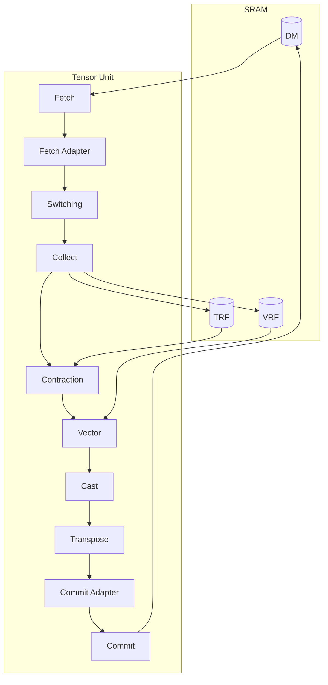

# 텐서 계산하기

## Tensor Unit

Tensor Unit 은 온칩 연산 파이프라인이다.
DM 에서 텐서 데이터를 읽어 열 개의 엔진을 거쳐 변환하고, 결과를 다시 DM 에 쓴다.

각 텐서는 사이클당 packet 하나씩, packet 스트림으로 파이프라인을 흐른다.
엔진들은 이 스트림을 소비하고 생산하면서 그 과정에서 사이클별 배치와 반복 순서를 바꾼다.
Collect Engine 은 들어오는 packet 을 32바이트 *flit* 으로 정규화한다.
아래쪽 모든 엔진([Contraction](./contraction-engine/index.md), [Vector](./vector-engine/index.md), [Cast](./cast-engine.md), [Transpose](./transpose-engine.md), [Commit Adapter](./commit-adapter.md), [Commit](../moving-tensors/commit-engine.md))은 이 flit 위에서 동작한다.

| 엔진 | 기능 | 핵심 제약 |
|--------|----------|----------------|
| [Fetch](../moving-tensors/fetch-engine.md) | DM 에서 파이프라인으로 데이터를 적재 | Packet 은 8바이트 정렬이어야 한다; `Slice` 는 바뀌지 않는다 |
| [Fetch Adapter](./fetch-adapter.md) | fetch 이후 원소 단위 변환(마스킹, 테이블 조회, 캐스트) | 선택적; 생략하면 항등 |
| [Switching](./switch-engine.md) | 슬라이스를 가로질러 데이터를 옮김 | 링 네트워크, `Slice` 가 바뀔 수 있음 |
| [Collect](./collect-engine.md) | packet 을 32바이트 flit 으로 정규화 | 출력 = 정확히 flit 하나 |
| [Contraction](./contraction-engine/index.md) | einsum: matmul, 컨볼루션, 어텐션 | 한쪽 피연산자는 TRF 에 상주하고, 다른 쪽은 스트리밍 |
| [Vector](./vector-engine/index.md) | 원소 단위·이항·리듀스 연산 | i32/f32 입력만 |
| [Cast](./cast-engine.md) | 배치를 동반한 정밀도 낮추기 | 출력 = 정확히 flit 하나 |
| [Transpose](./transpose-engine.md) | flit 안에서 원소 재배열 | flit 내부만 |
| [Commit Adapter](./commit-adapter.md) | commit 이전 원소 단위 변환(캐스트, ReLU, valid count 패킹, 절단)과 [Generate Mode](./commit-adapter.md#generate-mode) 서브 컨텍스트 우회 | 선택적; `.commit()` 앞에 체이닝 |
| [Commit](../moving-tensors/commit-engine.md) | 결과를 DM 에 다시 씀 | flit 정렬 쓰기 |

Tensor Unit 안의 각 텐서 스트림은 `[Chip, Cluster, Slice, Time, Packet]` 다섯 차원을 지니며, 이 차원들은 두 무리로 나뉜다.
`Chip`, `Cluster`, `Slice` 는 공간 차원이다: 각 슬라이스가 자기 파이프라인 인스턴스를 돌리고, 슬라이스는 클러스터로, 클러스터는 칩으로 묶인다.
`Time` 과 `Packet` 은 슬라이스별 스트림을 기술한다(정의는 [공간 차원과 시간 차원](../mapping-tensors/spatial-temporal-dimensions.md) 참고).
위의 엔진들은 파이프라인을 따라 `Time` / `Packet` 을 재배치한다.
공간 차원은 두 엔진을 빼면 모든 엔진에서 보존된다: [Switch](./switch-engine.md) 는 슬라이스를 가로질러 데이터를 옮기며 `Slice` 를 바꾸고, [Vector](./vector-engine/index.md) 의 [inter-slice reducer](./vector-engine/inter-slice-reducer.md) 는 클러스터 안 256개 슬라이스에 걸쳐 집계하며 `Slice` 를 접는다.

Contraction Engine 과 Vector Engine 은 각각 한쪽 피연산자를 파이프라인 스트림에서, 다른 쪽 피연산자를 슬라이스별 전용 레지스터 파일에서 받는다.
TRF (Tensor Register File) 가 Contraction Engine 에, VRF (Vector Register File) 가 Vector Engine 에 공급한다.
Collect Engine 은 `.to_trf()` 로 TRF 에, `.to_vrf()` 로 VRF 에 쓴다.
두 파일을 모두 쓰는 종단간 예제는 [Quick Start](../quick-start.md) 를 참고한다.

Fetch 는 DM 에서 읽고 Commit 은 DM 에 다시 쓴다.
이들의 자세한 Sequencer 동작은 여기가 아니라 [텐서 옮기기](../moving-tensors/index.md)에 문서화되어 있다.

## 실행 컨텍스트

[스케줄러](../scheduling.md)는 각 *실행 컨텍스트*를 독립적인 연산 스트림으로 취급한다.
하드웨어는 세 개를 노출한다:

- **Main** 은 커널의 주 연산을 위해 Tensor Unit 파이프라인을 구동한다.
- **Sub** 는 같은 파이프라인의 부분집합을 구동하며, 보통 main 이 연산하는 동안 피연산자를 TRF / VRF 로 프리페치한다.
- **DMA** 는 Tensor Unit 외부에서 DMA Engine 만 구동한다(HBM ↔ DM, HBM ↔ SPM, DM ↔ SPM).

main 컨텍스트는 모든 Tensor Unit 엔진을 구동할 수 있다.
sub 컨텍스트는 Contraction Engine 과 그 밖의 몇 가지 기능을 빼며, 나머지는 전부 main 에서 그대로 이어받는다.

연산은 한 컨텍스트 안에서는 직렬화되지만 서로 다른 컨텍스트끼리는 병렬로 실행된다.
예를 들어 main 이 현재 피연산자 배치를 연산하는 동안 sub 는 다음 피연산자 배치를 TRF / VRF 로 프리페치하고(*더블 버퍼링*), DMA Engine 은 두 Tensor Unit 컨텍스트 어느 쪽과도 무관하게 HBM 과 DM / SPM 사이로 대량 데이터를 옮긴다(*오버랩*).

일부 Tensor Unit 엔진은 한 번에 한 컨텍스트만 구동할 수 있는 하나의 스케줄링 단위를 이룬다.
예를 들어 Vector Engine 과 Cast Engine 이 그런 스케줄링 단위 하나를 이룬다.
그래서 sub 가 Vector Engine 작업을 돌리고 있으면 main 은 sub 와 직렬화되는 것을 피하려고 Cast Engine 대신 [Commit Adapter 의 Type Casting 단계](./commit-adapter.md#type-casting)를 통해 타입 캐스팅을 수행한다.

스케줄러는 어떤 Tensor Unit 연산의 DM 접근 패턴이 하드웨어 수준 메모리 충돌을 일으킬 위험이 있을 때 그 연산을 방어적으로 DMA 컨텍스트에 배정하기도 한다(이를 유발하는 규칙은 [메모리 성능](../moving-tensors/memory-performance.md) 참고).

