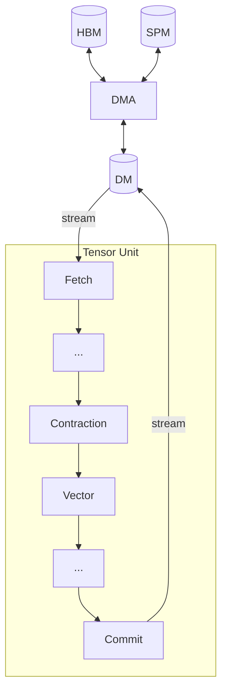

# 텐서 이동

[빠른 시작](../quick-start.md#memory-tiers)에서 TCP 의 메모리 계층을 소개했다.
이 장은 그중 HBM, DM, SPM 세 계층 사이를 텐서가 전용 엔진 세 개를 거쳐 이동하는 방식을 다룬다:
- **[Fetch](./fetch-engine.md)**: DM → Tensor Unit 스트림
- **[Commit](./commit-engine.md)**: Tensor Unit 스트림 → DM
- **[DMA](./dma-engine.md)**: DM, SPM, HBM 중 임의의 쌍

TRF 와 VRF 는 전용 이동 엔진이 아니라 Tensor Unit 프리미티브가 채우며, [텐서 연산](../computing-tensors/index.md)에서 다룬다.

이들의 API 는 프로그래머가 제어하는 것, 즉 어떤 엔진이 각 텐서를 옮기는지와 축이 하드웨어 차원에 어떻게 매핑되는지를 중심으로 설계되었다.
컴파일러는 이 선언을 메모리 뱅크 스케줄링, 스트라이드 계산, 접근 정렬 같은 저수준 하드웨어 사안으로 번역한다.

[Sequencer](./sequencer.md) 는 세 엔진 모두가 메모리 버퍼와 패킷 스트림 사이를 변환하는 데 쓰는 공용 메커니즘이다.
[메모리 성능](./memory-performance.md)은 엔진 선택과 축 매핑이 대역폭 활용에 어떤 영향을 주는지 다룬다.
