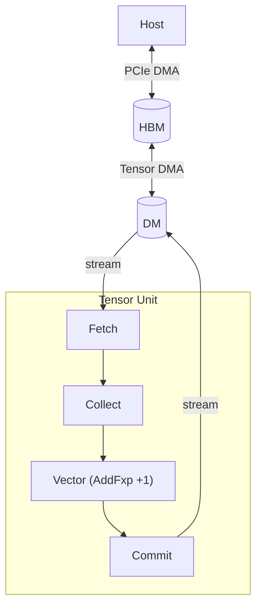
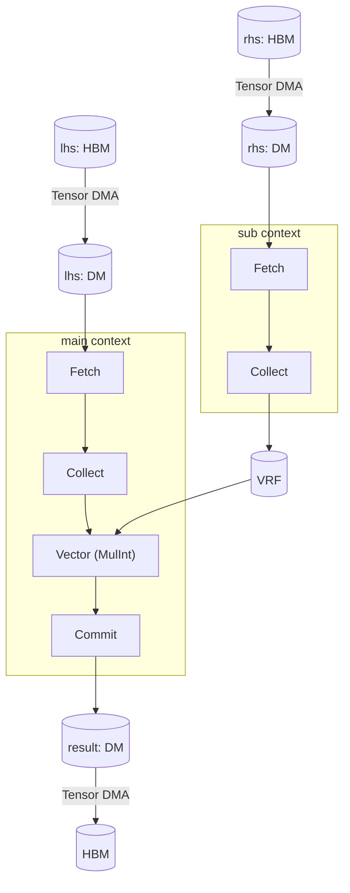

# 빠른 시작

이 장은 다섯 개의 실행 예제로 TCP 를 설명하며, 각 예제는 새 하드웨어 개념을 하나씩 도입한다.
앞의 두 예제는 원소 단위 연산을 다룬다.
나머지 세 개는 텐서 축약(dot product, GEMV, GEMM)을 다룬다.

## 수학적 배경

TCP 는 텐서 축약을 가속하기 위해 만들어진 텐서 네이티브 프로세서다.

### Tensor

*텐서*는 *텐서 인덱스*에서 값으로 가는 매핑이며, 텐서의 *모양(shape)*이 유효한 인덱스를 정의한다.

*모양*은 이름 붙은 축들의 *순서 없는 집합*이다.
모양 \\(\\{\texttt{N} = 4, \texttt{C} = 3\\}\\) 와 \\(\\{\texttt{C} = 3, \texttt{N} = 4\\}\\) 는 같은 텐서를 가리킨다. 의미를 담는 것은 위치가 아니라 축 이름이다.
*텐서 인덱스*는 각 축마다 인덱스 값을 지정해 만든다.
모양 \\(\\{\texttt{N} = 4, \texttt{C} = 3\\}\\) 의 유효한 인덱스는 \\(\\{\texttt{N}: 0, \texttt{C}: 0\\}\\), \\(\\{\texttt{N}: 0, \texttt{C}: 1\\}\\), \\(\\{\texttt{N}: 0, \texttt{C}: 2\\}\\), \\(\\{\texttt{N}: 1, \texttt{C}: 0\\}\\) 등이다.

축 순서를 한 번 정하면 텐서는 익숙한 다차원 배열처럼 동작하며, NumPy 의 [`ndarray`](https://numpy.org/doc/stable/reference/generated/numpy.ndarray.html) 와 비슷하다.
- 0D 텐서(스칼라): \\(5.2\\) 같은 단일 숫자
- 1D 텐서(벡터): 축이 하나인 \\([1, 2, 3]\\) 같은 수열
- 2D 텐서(행렬): 축이 둘인 \\(2 \times 4\\) 격자
- 4D 텐서: 모양이 \\(\\{\texttt{N} = 4, \texttt{C} = 3, \texttt{H} = 256, \texttt{W} = 512\\}\\) 인 RGB 이미지 배치


### Tensor Contraction

*텐서 축약*은 행렬곱을 임의의 텐서로 일반화한 것으로, 두 입력 텐서를 원소 단위로 곱한 뒤 공유되는(축약되는) 축을 따라 더한다.
모든 축약은 Broadcast, Multiply, Reduce 세 단계로 분해된다.
*Einsum 표기법*은 축약을 간결하게 표현한다. 각 입력 텐서를 축 레이블로 나열하고, 출력 축은 `→` 화살표 뒤에 쓰며, 출력에 없는 입력 축은 축약된다.

다음 표는 세 가지 축약을 einsum 표기와 Broadcast-Multiply-Reduce 분해로 보여 준다.

| 연산 | Einsum | Broadcast | Multiply | Reduce |
|-----------|--------|-----------|----------|--------|
| Dot product | \\(I, I \rightarrow 1\\) | 없음 (축이 일치) | \\(x_i y_i\\) | \\(\sum_i x_i y_i\\) |
| GEMV | \\(IJ, J \rightarrow I\\) | \\(x\\) 를 \\(I\\) 에 걸쳐 브로드캐스트 | \\(A_{ij} x_j\\) | \\(y_i = \sum_j A_{ij} x_j\\) |
| GEMM | \\(IK, KJ \rightarrow IJ\\) | \\(A\\) 는 \\(J\\) 에, \\(B\\) 는 \\(I\\) 에 | \\(A_{ik} B_{kj}\\) | \\(C_{ij} = \sum_k A_{ik} B_{kj}\\) |

## Tensor Contraction Processor

### 하드웨어 계층

TCP 디바이스는 네 단계의 중첩된 하드웨어 레벨로 구성된다.

| 레벨 | 개수 (RNGD) | 역할 |
|-------|-------------|------|
| `Chip` | (시스템에 따라 다름) | 최상위 단위. HBM 을 보유 |
| `Cluster` | 칩당 2개 | 슬라이스 256개를 묶음 |
| `Slice` | 클러스터당 256개 | Tensor Unit 하나를 실행 |
| `Lane` | 슬라이스당 8개 | Contraction Engine 의 MAC(multiply-accumulate) 배열의 한 행 |


### Tensor Unit

Tensor Unit 은 고정된 파이프라인이다: Fetch → Switch → Collect → Contraction → Vector → Cast → Transpose → Commit.
대부분의 단계는 각 슬라이스 안에서 독립적으로 동작한다.
Switch Engine 만 예외로, 슬라이스들을 연결해 슬라이스 배열 전체로 데이터를 분배한다.

`.contract_outer()`, `.contract_packet()`, `.contract_time()`, `.contract_lane()`, `.cast()`, `.switch()`, `.vector_fxp()` 와 파이프라인의 각 엔진은 [텐서 계산하기](./computing-tensors/index.md) 를 참고한다.

<a id="memory-tiers"></a>
### 메모리 계층

| 타입 | 위치 | 용량 (RNGD) | 역할 |
|------|----------|-----------------|------|
| `HbmTensor` | 패키지 위 | 48 GB, 1.5 TB/s | 가중치와 활성값의 장기 저장 |
| `DmTensor` | 온칩 SRAM | 총 256 MB, 슬라이스당 512 KB | 연산의 주 작업 메모리 |
| `SpmTensor` | 온칩 SRAM | 크기 미정, 칩당 2 TB/s | 시간 지역성이 높은 임시 데이터와 중간 결과. 컴파일러가 관리 |
| `TrfTensor` | 온칩 SRAM | 레인당 8 KB (슬라이스당 8 레인) | Contraction Engine 용 TRF |
| `VrfTensor` | 온칩 SRAM | 슬라이스당 8 KB | Vector Engine 용 피연산자 레지스터 파일 |


`.to_dm()`, `.to_hbm()`, `.fetch()`, `.commit()` 과 전체 메모리 계층 모델은 [텐서 옮기기](./moving-tensors/index.md) 를 참고한다.

### 텐서 매핑

TCP 의 Virtual ISA 는 타입 시스템을 통해 하드웨어 계층을 드러낸다.
각 텐서 타입은 원소 타입과, 각 논리 축이 하드웨어 계층에 어떻게 분산되는지를 인코딩한다.

예를 들어 `DmTensor<bf16, m![1], m![1 # 2], m![A / 8 # 256], m![A % 8]>` (`axes![A = 2048]` 일 때) 는 `bf16` 벡터를 나타내며, 축 `A` 가 칩 하나(`m![1]`), 두 클러스터 중 하나(`m![1 # 2]`) 위에 놓이고, 256개 슬라이스에 분산되며(`m![A / 8 # 256]`) 슬라이스당 8개 원소(`m![A % 8]`)를 갖는다.
따라서 `A` 의 각 원소는 정확히 하나의 슬라이스 안의 잘 정의된 위치로 매핑된다.

`m![]` 안의 연산자 세 개가 이 분산을 구성한다.
- `/` 는 스트라이드로 나눈다. `A / 8` 은 2048 / 8 = 256 개의 슬라이스 인덱스를 준다.
- `%` 는 안쪽 개수를 준다. `A % 8` 은 슬라이스 내부 인덱스 8개를 준다.
- `#` 는 하드웨어 유닛 개수에 맞춰 패딩한다. `# 256` 은 256 슬라이스로 패딩하며, 남는 칸은 임의값을 갖는다.

TCP 는 Tensor Unit 파이프라인을 흐르는 텐서를 위해 매개변수 두 개도 도입한다. `Time` 은 파이프라인 반복을 인덱싱하고, `Packet` 은 각 반복 안의 원소를 인덱싱한다.

`axes![]`, `m![]`, `HbmTensor`, `DmTensor` 와 전체 매핑 표현식 레퍼런스는 [텐서 매핑하기](./mapping-tensors/index.md) 를 참고한다.

### 실행 컨텍스트

모든 디바이스 커널은 별도의 하드웨어 자원에서 동시에 도는 두 개의 실행 컨텍스트 `ctx.main` 과 `ctx.sub` 를 갖는다.
`main` 은 주 연산을 실행한다.
`sub` 는 동시 실행 파이프라인으로, 보통 `main` 이 계산하는 동안 피연산자를 TRF 나 VRF 로 프리페치하는 데 쓴다.
`main` 이 아직 `sub` 가 가져오는 중인 피연산자를 필요로 하면, `main` 은 동기화를 위해 `sub` 의 실행을 자동으로 기다린다.

두 컨텍스트는 같은 평탄한 온칩 SRAM 을 공유한다.
DM 주소는 선택 사항이다. (`.to_dm()` 과 `.commit()` 처럼) 생략하면 배치가 자동으로 지정되고, 커널이 명시적이고 겹치지 않는 제어를 필요로 할 때는 `_at` 변형(`.to_dm_at(addr)`, `.commit_at(addr)`)으로 특정 주소를 고정한다.

타입 시그니처에서 const-generic `Tu` 는 텐서가 어느 컨텍스트를 흐르는지 식별한다(`{ Tu::Main }` 또는 `{ Tu::Sub }`).

`ctx.main`, `ctx.sub`, `launch()` 와 연산이 컨텍스트에 걸쳐 어떻게 스케줄링되고 병렬 실행되는지는 [스케줄링](./scheduling.md) 을 참고한다.

## 커널 예제

### 상수 덧셈

첫 번째 커널은 정수 벡터를 받아 각 원소에 상수 `1` 을 더한다.
칩 하나, 두 클러스터 중 하나, 그 클러스터의 256개 슬라이스 전부를 쓰며, 슬라이스당 8원소 그룹 하나를 둔다.
각 원소에 `1` 을 더하는 데는 [Vector Engine](./computing-tensors/vector-engine/index.md) 의 고정소수점 연산 `vector_fxp(FxpBinaryOp::AddFxp, 1)` 을 쓴다.



`to_dm` 은 데이터를 HBM 에서 DM 으로 옮기며, 평탄한 텐서를 256개 슬라이스에 나눈다.
`begin → fetch → collect → vector_init → vector_intra_slice_tag → vector_fxp → vector_final → commit` 체인이 각 슬라이스를 한 번의 패스로 처리한다.
`TagMode::Zero` 는 파이프라인이 매 사이클 실행되도록 설정한다.

커널 ([`src/kernel/constant_add_kernel.rs`](https://github.com/furiosa-ai/furiosa-opt/blob/main/base-template/src/kernel/constant_add_kernel.rs)):

```rust,ignore
use furiosa_opt_std::prelude::*;

axes![A = 2048];

pub type Chip = m![1];
pub type Cluster = m![1 # 2];
pub type Slice = m![A / 8 # 256];

#[device(chip = 1)]
pub fn constant_add_kernel(ctx: &mut Context, input: &HbmTensor<i32, Chip, m![A]>) -> HbmTensor<i32, Chip, m![A]> {
    // HBM → DM: split 2048 elements across 256 slices (8 elements per slice)
    let dm = input.to_dm::<Cluster, Slice, m![A % 8]>(&mut ctx.tdma);

    let result = ctx
        .main
        .begin(dm.view())
        // Fetch: stream 8-element packets from DM into the pipeline
        .fetch::<m![1], m![A % 8]>()
        // Collect: normalize the stream into 32-byte flits (8 × i32)
        .collect::<m![1], m![A % 8]>()
        // Vector Engine: enter pipeline and arm unconditionally
        .vector_init()
        .vector_intra_slice_tag(TagMode::Zero)
        // Add the scalar constant 1 to every element
        .vector_fxp(FxpBinaryOp::AddFxp, 1)
        // Exit VE and commit: trim the packet to the commit width, then write
        // results back to DM
        .vector_final()
        .commit_trim::<m![A % 8]>()
        .commit::<m![A % 8]>();

    // DM → HBM
    result.to_hbm(&mut ctx.tdma)
}
```

호스트 프로그램 ([`src/constant_add.rs`](https://github.com/furiosa-ai/furiosa-opt/blob/main/base-template/src/constant_add.rs)):

```rust,ignore
use furiosa_opt_std::prelude::*;
use {{ crate_name }}::kernel::constant_add_kernel::{A, constant_add_kernel};
use rand::SeedableRng;
use rand::rngs::SmallRng;

#[tokio::main]
async fn main() {
    let mut ctx = Context::acquire();
    let mut rng = SmallRng::seed_from_u64(42);
    let input = HostTensor::<i32, m![A]>::rand(&mut rng);
    let in_hbm = input.to_hbm(&mut ctx.pdma).await;
    let _out_hbm = launch(constant_add_kernel, (&mut ctx, &in_hbm)).await;
    println!("Constant Add: kernel ran");
}

#[cfg(test)]
mod tests {
    use super::*;

    #[tokio::test]
    async fn matches_reference() {
        let mut ctx = Context::acquire();

        let mut rng = SmallRng::seed_from_u64(42);
        let input = HostTensor::<i32, m![A]>::rand(&mut rng);
        let in_hbm = input.to_hbm(&mut ctx.pdma).await;

        // Reference: out[i] = in[i] + 1.
        let in_buf: Vec<i32> = input.into_vec();
        let expected: Vec<i32> = in_buf.iter().map(|&x| x.wrapping_add(1)).collect();

        let out_hbm = launch(constant_add_kernel, (&mut ctx, &in_hbm)).await;

        // Under the typecheck backend `actual` is empty (phantom tensors), so
        // the loop trivially runs zero iterations and the assertion is skipped.
        let actual: Vec<i32> = out_hbm.to_host::<m![A]>(&mut ctx.pdma).await.into_vec();
        for (i, (&e, &a)) in expected.iter().zip(&actual).enumerate() {
            assert_eq!(e, a, "constant_add mismatch at i={i}: expected {e}, actual {a}");
        }
    }
}
```

### 원소 단위 곱셈

두 번째 커널은 같은 모양의 벡터 두 개를 원소 단위로 곱한다.
한쪽 피연산자는 파이프라인을 흐른다.
다른 쪽은 VRF(Vector Register File)에 저장되며, 이는 [Vector Engine](./computing-tensors/vector-engine/index.md) 이 매 사이클 읽는 슬라이스별 레지스터 파일이다.



이 예제는 `sub` 컨텍스트를 도입하는데, `main` 컨텍스트가 스트리밍하는 동안 피연산자 하나를 VRF 로 미리 적재한다.
`sub` 컨텍스트는 `rhs_dm` 을 Fetch → Collect → `.to_vrf()` 파이프라인을 거쳐 VRF 에 적재한다.
`rhs_dm` 은 `lhs_dm` 과 서로소인 DM 영역을 차지해 둘이 겹치지 않는다.
그다음 `main` 컨텍스트가 `lhs_dm` 을 스트리밍하며 각 원소를 `MulInt` 로 VRF 의 대응 원소와 곱한다.
하드웨어는 가능한 곳에서 두 컨텍스트를 동시에 실행한다.

커널 ([`src/kernel/elementwise_mul_kernel.rs`](https://github.com/furiosa-ai/furiosa-opt/blob/main/base-template/src/kernel/elementwise_mul_kernel.rs)):

```rust,ignore
use furiosa_opt_std::prelude::*;

axes![A = 2048];

pub type Chip = m![1];
pub type Cluster = m![1 # 2];
pub type Slice = m![A / 8 # 256];

#[device(chip = 1)]
pub fn elementwise_mul_kernel(
    ctx: &mut Context,
    lhs: &HbmTensor<i32, Chip, m![A]>,
    rhs: &HbmTensor<i32, Chip, m![A]>,
) -> HbmTensor<i32, Chip, m![A]> {
    // Move both operands from HBM to DM (DM placement is assigned automatically).
    let lhs_dm = lhs.to_dm::<Cluster, Slice, m![A % 8]>(&mut ctx.tdma);
    let rhs_dm = rhs.to_dm::<Cluster, Slice, m![A % 8]>(&mut ctx.tdma);

    // Sub context: load rhs into VRF (runs concurrently with the main context below).
    // VRF holds a per-slice operand that the Vector Engine reads every cycle.
    let rhs_vrf: VrfTensor<i32, Chip, Cluster, Slice, m![A % 8]> = ctx
        .sub
        .begin(rhs_dm.view())
        .fetch::<m![1], m![A % 8]>()
        .collect::<m![A % 8 / 8], m![A % 8 % 8]>()
        .to_vrf();

    // Main context: multiply every lhs element by its rhs counterpart from VRF
    let result = ctx
        .main
        .begin(lhs_dm.view())
        .fetch::<m![1], m![A % 8]>()
        .collect::<m![1], m![A % 8]>()
        .vector_init()
        .vector_intra_slice_tag(TagMode::Zero)
        // Each slice multiplies its 8 lhs elements by the matching 8 rhs elements in VRF
        .vector_fxp(FxpBinaryOp::MulInt, &rhs_vrf)
        .vector_final()
        .commit_trim::<m![A % 8]>()
        .commit::<m![A % 8]>();

    result.to_hbm(&mut ctx.tdma)
}
```

호스트 프로그램 ([`src/elementwise_mul.rs`](https://github.com/furiosa-ai/furiosa-opt/blob/main/base-template/src/elementwise_mul.rs)):

```rust,ignore
use furiosa_opt_std::prelude::*;
use {{ crate_name }}::kernel::elementwise_mul_kernel::{A, elementwise_mul_kernel};
use rand::SeedableRng;
use rand::rngs::SmallRng;

#[tokio::main]
async fn main() {
    let mut ctx = Context::acquire();
    let mut rng = SmallRng::seed_from_u64(42);
    let lhs = HostTensor::<i32, m![A]>::rand(&mut rng);
    let rhs = HostTensor::<i32, m![A]>::rand(&mut rng);
    let lhs_hbm = lhs.to_hbm(&mut ctx.pdma).await;
    let rhs_hbm = rhs.to_hbm(&mut ctx.pdma).await;
    let _out_hbm = launch(elementwise_mul_kernel, (&mut ctx, &lhs_hbm, &rhs_hbm)).await;
    println!("Elementwise Mul: kernel ran");
}

#[cfg(test)]
mod tests {
    use super::*;

    #[tokio::test]
    async fn matches_reference() {
        let mut ctx = Context::acquire();

        let mut rng = SmallRng::seed_from_u64(42);
        let lhs = HostTensor::<i32, m![A]>::rand(&mut rng);
        let rhs = HostTensor::<i32, m![A]>::rand(&mut rng);

        let lhs_hbm = lhs.to_hbm(&mut ctx.pdma).await;
        let rhs_hbm = rhs.to_hbm(&mut ctx.pdma).await;

        // Reference: out[i] = lhs[i] * rhs[i].
        let lhs_buf: Vec<i32> = lhs.into_vec();
        let rhs_buf: Vec<i32> = rhs.into_vec();
        let expected: Vec<i32> = lhs_buf.iter().zip(&rhs_buf).map(|(&a, &b)| a.wrapping_mul(b)).collect();

        let out_hbm = launch(elementwise_mul_kernel, (&mut ctx, &lhs_hbm, &rhs_hbm)).await;

        let actual: Vec<i32> = out_hbm.to_host::<m![A]>(&mut ctx.pdma).await.into_vec();
        for (i, (&e, &a)) in expected.iter().zip(&actual).enumerate() {
            assert_eq!(e, a, "elementwise_mul mismatch at i={i}: expected {e}, actual {a}");
        }
    }
}
```

### Dot Product

내적 \\(I, I \rightarrow 1\\) 은 브로드캐스트 단계 없이 두 피연산자를 같은 축을 따라 축약(리듀스)한다.
앞의 예제와 마찬가지로 한쪽 피연산자는 파이프라인을 흐른다.
다른 쪽은 TRF(Tensor Register File)에 정지 상태로 유지되며, 이는 [Contraction Engine](./computing-tensors/contraction-engine/index.md) 이 매 사이클 읽는 슬라이스별 레지스터 파일이다.
`sub` 컨텍스트는 `rhs` 를 Fetch → Collect → `.to_trf()` 를 거쳐 TRF 에 적재한다.
`TrfAddress::Full` 은 TRF 전체를 이 텐서에 할당한다.
`.contract_outer()` 는 Contraction Engine 의 Stream Adapter 와 TRF Sequencer 를 호출한다.
Stream Adapter 는 인접한 32바이트 flit 두 개를 Outer 단계의 64바이트 packet 으로 짝짓고, TRF Sequencer 는 정지 상태의 RHS 를 읽는다.
둘 다 레인마다 있는 원소 단위 곱셈기로 들어간다.
`.contract_packet()` 은 하드웨어 리듀스 트리를 통해 그 곱들을 공간적으로 리듀스-덧셈한다.
그다음 `.contract_time::<m![1]>()` 이 시간 방향으로 누적해 슬라이스당 스칼라 하나를 만든다.
`.contract_lane()` 은 8개 레인을 출력으로 접는다(여기서는 `Lane = m![1]` 이므로 자명한 접기다).
`.cast()` 는 `f32` 누적기 출력을 다시 `bf16` 으로 변환한다.


커널 ([`src/kernel/dot_product_kernel.rs`](https://github.com/furiosa-ai/furiosa-opt/blob/main/base-template/src/kernel/dot_product_kernel.rs)):

```rust,ignore
use furiosa_opt_std::prelude::*;

axes![A = 2048];

pub type Chip = m![1];
pub type Cluster = m![1 # 2];
pub type Slice = m![1 # 256]; // 1 active slice; m![A / 8 # 256] would distribute across all 256
pub type Time = m![1]; // No temporal iteration
pub type Lane = m![1]; // No lane parallelism

#[device(chip = 1)]
pub fn dot_product_kernel(
    ctx: &mut Context,
    lhs: &HbmTensor<bf16, Chip, m![A]>,
    rhs: &HbmTensor<bf16, Chip, m![A]>,
) -> HbmTensor<bf16, Chip, m![1]> {
    // HBM → DM
    let lhs: DmTensor<bf16, Chip, Cluster, Slice, m![A]> = lhs.to_dm(&mut ctx.tdma);
    let rhs: DmTensor<bf16, Chip, Cluster, Slice, m![A]> = rhs.to_dm(&mut ctx.tdma);

    // Sub context: load rhs into TRF (TrfAddress::Full dedicates the entire TRF to this tensor)
    let rhs: TrfTensor<bf16, Chip, Cluster, Slice, Lane, m![A]> = ctx
        .sub
        .begin(rhs.view())
        .fetch::<Time, m![A]>()
        .collect::<m![{ Time }, A / 16], m![A % 16]>()
        .to_trf();

    // Main context: stream lhs through the Contraction Engine, reduce along A
    let result: DmTensor<bf16, Chip, Cluster, Slice, m![1 # 8]> = ctx
        .main
        .begin(lhs.view())
        .fetch::<Time, m![A]>()
        .collect::<m![A / 16], m![A % 16]>()
        // Pair consecutive 32-byte flits into 64-byte packets, halving time steps (A/16 → A/32)
        .contract_outer::<m![A / 32], m![A % 32], _, _, _>(&rhs)
        .contract_packet::<m![1]>()
        .contract_time::<m![1]>()
        .contract_lane::<m![1], m![1 # 8]>(LaneMode::Interleaved)
        .cast::<bf16, m![1 # 16]>() // cast f32 accumulator output back to bf16
        .commit_trim::<m![1 # 8]>()
        .commit();

    // DM → HBM
    result.to_hbm(&mut ctx.tdma)
}
```

호스트 프로그램 ([`src/dot_product.rs`](https://github.com/furiosa-ai/furiosa-opt/blob/main/base-template/src/dot_product.rs)):

```rust,ignore
use furiosa_opt_std::prelude::*;
use {{ crate_name }}::kernel::dot_product_kernel::{A, dot_product_kernel};
use rand::SeedableRng;
use rand::rngs::SmallRng;

#[tokio::main]
async fn main() {
    let mut ctx = Context::acquire();
    let mut rng = SmallRng::seed_from_u64(42);
    let lhs = HostTensor::<bf16, m![A]>::rand(&mut rng);
    let rhs = HostTensor::<bf16, m![A]>::rand(&mut rng);
    let lhs_hbm = lhs.to_hbm(&mut ctx.pdma).await;
    let rhs_hbm = rhs.to_hbm(&mut ctx.pdma).await;
    let _out_hbm = launch(dot_product_kernel, (&mut ctx, &lhs_hbm, &rhs_hbm)).await;
    println!("Dot Product: kernel ran");
}

#[cfg(test)]
mod tests {
    use super::*;

    #[tokio::test]
    async fn matches_reference() {
        let mut ctx = Context::acquire();

        let mut rng = SmallRng::seed_from_u64(42);
        let lhs = HostTensor::<bf16, m![A]>::rand(&mut rng);
        let rhs = HostTensor::<bf16, m![A]>::rand(&mut rng);

        let lhs_hbm = lhs.to_hbm(&mut ctx.pdma).await;
        let rhs_hbm = rhs.to_hbm(&mut ctx.pdma).await;

        // Reference: sum_i lhs[i] * rhs[i] in f32, then round to bf16.
        let lhs_buf: Vec<bf16> = lhs.into_vec();
        let rhs_buf: Vec<bf16> = rhs.into_vec();
        let expected_f32: f32 = lhs_buf
            .iter()
            .zip(&rhs_buf)
            .map(|(&a, &b)| f32::from(a) * f32::from(b))
            .sum();
        let expected = bf16::from_f32(expected_f32);

        let out_hbm = launch(dot_product_kernel, (&mut ctx, &lhs_hbm, &rhs_hbm)).await;

        let actual_buf: Vec<bf16> = out_hbm.to_host::<m![1]>(&mut ctx.pdma).await.into_vec();
        if let Some(&actual) = actual_buf.first() {
            let diff = (f32::from(actual) - f32::from(expected)).abs();
            let tol = (0.02 * f32::from(expected).abs()).max(0.5);
            assert!(
                diff <= tol,
                "dot_product mismatch: expected {expected:?}, actual {actual:?}, diff {diff} > tol {tol}"
            );
        }
    }
}
```

### GEMV

GEMV \\(IJ, J \rightarrow I\\) 는 출력 차원 `I` 를 슬라이스에 분산한다. 각 슬라이스가 한 행 \\(y_i = \sum_j A_{ij} x_j\\) 를 계산한다.
모든 슬라이스가 같은 축을 따라 리듀스하고 재분배가 필요 없던 내적과 달리, 여기서는 각 슬라이스가 자기 행과 축약하기 위해 벡터 전체를 필요로 하므로 축약 전에 데이터를 슬라이스에 걸쳐 브로드캐스트해야 한다.

커널 ([`src/kernel/gemv_kernel.rs`](https://github.com/furiosa-ai/furiosa-opt/blob/main/base-template/src/kernel/gemv_kernel.rs)):

```rust,ignore
use furiosa_opt_std::prelude::*;

axes![I = 256, J = 2048];

pub type Chip = m![1];
pub type Cluster = m![1 # 2];
pub type Slice = m![I]; // Distribute output dimension across slices
pub type Time = m![J / 32]; // Temporal iterations for reduction dimension
pub type Packet = m![J % 32]; // Packet size for reduction dimension
pub type Lane = m![1];

#[device(chip = 1)]
pub fn gemv_kernel(
    ctx: &mut Context,
    matrix: &HbmTensor<bf16, Chip, m![I, J]>,
    vector: &HbmTensor<bf16, Chip, m![J]>,
) -> HbmTensor<bf16, Chip, m![I]> {
    // Move data from HBM to DM
    let matrix: DmTensor<bf16, Chip, Cluster, Slice, m![J]> = matrix.to_dm(&mut ctx.tdma);
    let vector: DmTensor<bf16, Chip, Cluster, Slice, m![J]> = vector.to_dm(&mut ctx.tdma);

    // Load vector into TRF
    let vector_trf: TrfTensor<bf16, Chip, Cluster, Slice, Lane, m![J]> = ctx
        .sub
        .begin(vector.view())
        .fetch::<m![1], m![J]>()
        // Collect Engine: split into 32-byte flits.
        .collect::<m![J / 16], m![J % 16]>()
        .to_trf();

    // Compute GEMV: matrix × vector
    // Key difference: `I` maps to slice (preserved), `J` gets reduced
    let result: DmTensor<bf16, Chip, Cluster, Slice, m![1 # 4]> = ctx
        .main
        .begin(matrix.view())
        .fetch::<m![J / 16], m![J % 16]>()
        .collect::<m![J / 16], m![J % 16]>()
        .contract_outer::<Time, Packet, _, _, _>(&vector_trf)
        .contract_packet::<m![1]>()
        .contract_time::<m![1]>()
        .contract_lane::<m![1], m![1 # 8]>(LaneMode::Interleaved)
        .cast::<bf16, m![1 # 16]>()
        .commit_trim::<m![1 # 4]>()
        .commit();

    // Transfer result to HBM
    result.to_hbm(&mut ctx.tdma)
}
```

호스트 프로그램 ([`src/gemv.rs`](https://github.com/furiosa-ai/furiosa-opt/blob/main/base-template/src/gemv.rs)):

```rust,ignore
use furiosa_opt_std::prelude::*;
use {{ crate_name }}::kernel::gemv_kernel::{I, J, gemv_kernel};
use rand::SeedableRng;
use rand::rngs::SmallRng;

#[tokio::main]
async fn main() {
    let mut ctx = Context::acquire();
    let mut rng = SmallRng::seed_from_u64(42);
    let matrix = HostTensor::<bf16, m![I, J]>::rand(&mut rng);
    let vector = HostTensor::<bf16, m![J]>::rand(&mut rng);
    let matrix_hbm = matrix.to_hbm(&mut ctx.pdma).await;
    let vector_hbm = vector.to_hbm(&mut ctx.pdma).await;
    let _out_hbm = launch(gemv_kernel, (&mut ctx, &matrix_hbm, &vector_hbm)).await;
    println!("GEMV: kernel ran");
}

#[cfg(test)]
mod tests {
    use super::*;

    #[tokio::test]
    async fn matches_reference() {
        let mut ctx = Context::acquire();

        let mut rng = SmallRng::seed_from_u64(42);
        let matrix = HostTensor::<bf16, m![I, J]>::rand(&mut rng);
        let vector = HostTensor::<bf16, m![J]>::rand(&mut rng);

        let matrix_hbm = matrix.to_hbm(&mut ctx.pdma).await;
        let vector_hbm = vector.to_hbm(&mut ctx.pdma).await;

        // Reference: y[i] = sum_j matrix[i, j] * vector[j] in f32, rounded to bf16.
        let mat_buf: Vec<bf16> = matrix.into_vec();
        let vec_buf: Vec<bf16> = vector.into_vec();
        let expected: Vec<bf16> = mat_buf
            .chunks(J::SIZE)
            .map(|row| {
                let acc: f32 = row
                    .iter()
                    .zip(&vec_buf)
                    .map(|(&a, &b)| f32::from(a) * f32::from(b))
                    .sum();
                bf16::from_f32(acc)
            })
            .collect();

        let out_hbm = launch(gemv_kernel, (&mut ctx, &matrix_hbm, &vector_hbm)).await;

        let actual: Vec<bf16> = out_hbm.to_host::<m![I]>(&mut ctx.pdma).await.into_vec();
        for (i, (&e, &a)) in expected.iter().zip(&actual).enumerate() {
            let diff = (f32::from(a) - f32::from(e)).abs();
            let tol = (0.02 * f32::from(e).abs()).max(0.5);
            assert!(
                diff <= tol,
                "gemv mismatch at i={i}: expected {e:?}, actual {a:?}, diff {diff} > tol {tol}"
            );
        }
    }
}
```

### GEMM

GEMM \\(IK, JK \rightarrow IJ\\) 는 두 번째 출력 차원을 더한다. 출력 \\(C_{ij} = \sum_k A_{ik} B_{jk}\\) 에 \\(I\\) 와 \\(J\\) 가 모두 나타난다.
각 행렬은 자신에게 없는 출력 차원을 따라 브로드캐스트된다. \\(A\\) 는 \\(J\\) 에 걸쳐, \\(B\\) 는 \\(I\\) 에 걸쳐 브로드캐스트된다.

새로운 개념은 `type Slice = m![I / 32, J / 32]` 로, 두 출력 차원을 함께 `Slice` 에 매핑해 각 슬라이스가 출력 행렬의 16 × 16 타일을 계산하게 한다.
Switch Engine 이 `B` 의 각 타일을 대응하는 슬라이스로 옮기므로, 각 슬라이스는 자기 몫의 `J` 만 본다.
`.contract_packet::<m![1]>()` 은 `K` 를 따라 공간적으로 리듀스한다.
`.contract_time::<m![I]>()` 은 시간에 걸쳐 누적하며(`I` 를 보존), `.contract_lane::<m![I], m![J # 8]>(LaneMode::Interleaved)` 은 `Lane` 을 출력 packet 으로 접어 출력에 `I` 와 `J` 를 모두 보존한다.

커널 ([`src/kernel/gemm_kernel.rs`](https://github.com/furiosa-ai/furiosa-opt/blob/main/base-template/src/kernel/gemm_kernel.rs)):

```rust,ignore
use furiosa_opt_std::prelude::*;

axes![I = 512, J = 512, K = 64];

pub type Chip = m![1];
pub type Cluster = m![1 # 2];
// Distribute output dimensions `I` and `J` across slices
pub type Slice = m![I / 32, J / 32]; // Each slice handles a 16 × 16 output tile
pub type Lane = m![J % 8];

#[device(chip = 1)]
pub fn gemm_kernel(
    ctx: &mut Context,
    a: &HbmTensor<bf16, Chip, m![I, K]>,
    b: &HbmTensor<bf16, Chip, m![J, K]>,
) -> HbmTensor<bf16, Chip, m![I, J]> {
    // Move data from HBM to DM
    let a: DmTensor<bf16, Chip, Cluster, Slice, m![I % 32, K]> = a.to_dm(&mut ctx.tdma);
    let b: DmTensor<bf16, Chip, Cluster, Slice, m![J % 32, K]> = b.to_dm(&mut ctx.tdma);

    // Load matrix B into TRF
    // Switch Engine distributes B across 256 slices
    // Each slice gets the full `K` dimension but only its (16 × 16) output tile
    // See: Switch Engine topologies for details on distribution
    let b_trf: TrfTensor<bf16, Chip, Cluster, Slice, Lane, m![J / 8 % 4, K]> = ctx
        .sub
        .begin(b.view())
        .fetch::<m![J % 8, J / 8 % 4], m![K]>()
        .collect::<m![J % 8, J / 8 % 4, K / 16], m![K % 16]>()
        .to_trf();

    // Compute GEMM: A × B
    // Switch Engine ensures matching (`I / 32`, `J / 32`) slice distribution
    // Contraction reduces along `K`, preserves `I` and `J`
    let result: DmTensor<bf16, Chip, Cluster, Slice, m![I % 32, J % 32]> = ctx
        .main
        .begin(a.view())
        .fetch::<m![I % 32, J / 8 % 4], m![K]>()
        .collect::<m![I % 32, J / 8 % 4, K / 16], m![K % 16]>()
        .contract_outer::<m![I % 32, J / 8 % 4, K / 32], m![K % 32], _, _, _>(&b_trf)
        .contract_packet::<m![1]>()
        .contract_time::<m![I % 32, J / 8 % 4]>()
        .contract_lane::<m![I % 32, J / 8 % 4], m![J % 8]>(LaneMode::Interleaved)
        .cast::<bf16, m![J % 8 # 16]>()
        .commit_trim::<m![J % 8]>()
        .commit();

    // Transfer result to HBM
    result.to_hbm(&mut ctx.tdma)
}
```

호스트 프로그램 ([`src/gemm.rs`](https://github.com/furiosa-ai/furiosa-opt/blob/main/base-template/src/gemm.rs)):

```rust,ignore
use furiosa_opt_std::prelude::*;
use {{ crate_name }}::kernel::gemm_kernel::{I, J, K, gemm_kernel};
use rand::SeedableRng;
use rand::rngs::SmallRng;

#[tokio::main]
async fn main() {
    let mut ctx = Context::acquire();
    let mut rng = SmallRng::seed_from_u64(42);
    let a = HostTensor::<bf16, m![I, K]>::rand(&mut rng);
    let b = HostTensor::<bf16, m![J, K]>::rand(&mut rng);
    let a_hbm = a.to_hbm(&mut ctx.pdma).await;
    let b_hbm = b.to_hbm(&mut ctx.pdma).await;
    let _out_hbm = launch(gemm_kernel, (&mut ctx, &a_hbm, &b_hbm)).await;
    println!("GEMM: kernel ran");
}

#[cfg(test)]
mod tests {
    use super::*;

    #[tokio::test]
    async fn matches_reference() {
        let mut ctx = Context::acquire();

        let mut rng = SmallRng::seed_from_u64(42);
        let a = HostTensor::<bf16, m![I, K]>::rand(&mut rng);
        let b = HostTensor::<bf16, m![J, K]>::rand(&mut rng);

        let a_hbm = a.to_hbm(&mut ctx.pdma).await;
        let b_hbm = b.to_hbm(&mut ctx.pdma).await;

        // Reference: C[i, j] = sum_k A[i, k] * B[j, k] in f32, rounded to bf16.
        let a_buf: Vec<bf16> = a.into_vec();
        let b_buf: Vec<bf16> = b.into_vec();
        let expected: Vec<bf16> = a_buf
            .chunks(K::SIZE)
            .flat_map(|a_row| {
                b_buf.chunks(K::SIZE).map(move |b_row| {
                    let acc: f32 = a_row
                        .iter()
                        .zip(b_row)
                        .map(|(&a, &b)| f32::from(a) * f32::from(b))
                        .sum();
                    bf16::from_f32(acc)
                })
            })
            .collect();

        let out_hbm = launch(gemm_kernel, (&mut ctx, &a_hbm, &b_hbm)).await;

        let actual: Vec<bf16> = out_hbm.to_host::<m![I, J]>(&mut ctx.pdma).await.into_vec();
        for (idx, (&e, &av)) in expected.iter().zip(&actual).enumerate() {
            let diff = (f32::from(av) - f32::from(e)).abs();
            let tol = (0.05 * f32::from(e).abs()).max(1.0);
            assert!(diff <= tol, "gemm mismatch at idx={idx}: expected {e:?}, actual {av:?}");
        }
    }
}
```


위 예제들은 하드웨어 패스 한 번에 들어가는 텐서를 처리한다.
실제 워크로드는 흔히 타일 분할을 요구한다.
슬라이스당 512 KB 인 DM 용량을 넘는 워크로드에는 상호 보완적인 두 전략이 있다. 시간 분할은 타일을 시간에 걸쳐 순차 처리하고, 공간 분할은 타일을 병렬 하드웨어 유닛에 분산한다.

이 전략들을 적용한 엔드투엔드 커널은 [커널 예제](./kernel-examples/index.md) 를 참고한다.
