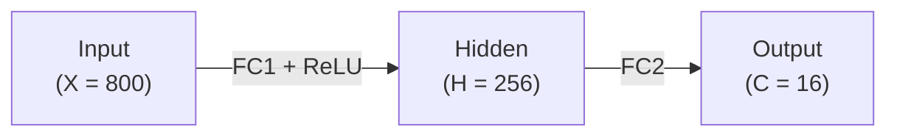
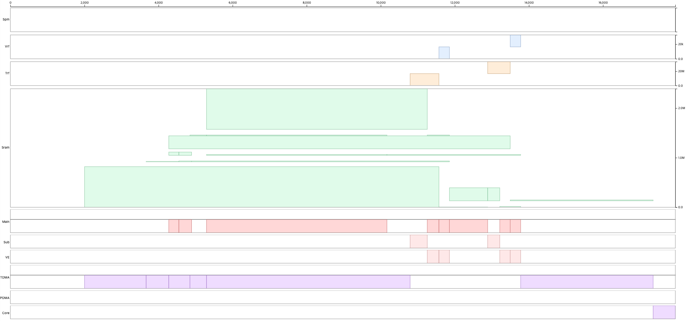
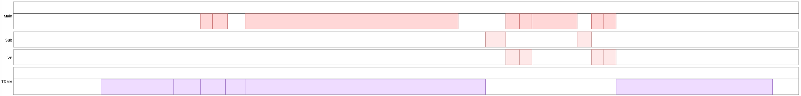
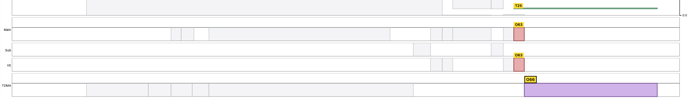
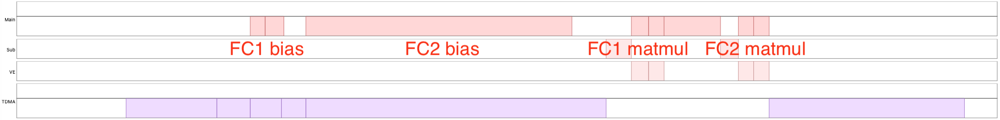
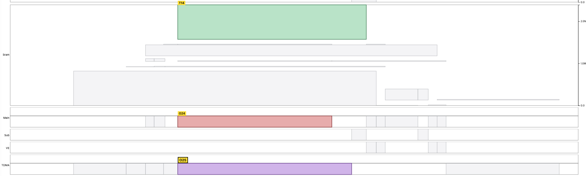
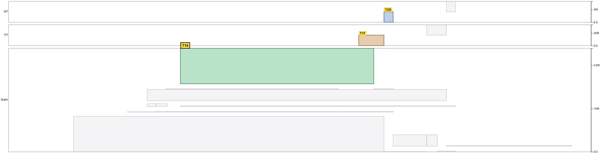

# 스케줄링


스케줄러는 프로그래머가 준 입력, 즉 각 연산에 선택된 실행 컨텍스트, 연산이 쓰인 순서, 명시적인 메모리 주소 배정으로부터 vISA 프로그램을 실행 스케줄로 옮긴다.
스케줄러는 순차 실행과 정확히 같은 결과를 보존하면서 실행 사이클을 줄인다.

## 기본 스케줄링 규칙

이 장은 [`furiosa-opt-examples/src/mnist/mod.rs`](https://github.com/furiosa-ai/furiosa-opt/blob/main/furiosa-opt-examples/src/mnist/mod.rs) 의 MNIST vISA 커널로 기본 스케줄링 규칙을 설명한다.
그 스케줄은 Schedule Viewer 로 시각화한다. [Schedule Viewer 부록](./appendix/schedule-viewer.md)을 보라.

### MNIST 커널

MNIST 커널은 2층 MLP 다.



```rust,ignore
axes![X = 800, H = 256, C = 16];

type Chip = m![1];
type Cluster = m![1 # 2];

#[device(chip = 1)]
pub fn forward(
    ctx: &mut Context,
    input: &HbmTensor<bf16, Chip, m![X]>,
    fc1_weight: &HbmTensor<bf16, Chip, m![H, X]>,
    fc1_bias: &HbmTensor<bf16, Chip, m![H]>,
    fc2_weight: &HbmTensor<bf16, Chip, m![C, H]>,
    fc2_bias: &HbmTensor<bf16, Chip, m![C]>,
) -> HbmTensor<bf16, Chip, m![C]> {
    let hidden = fc1_relu(ctx, input, fc1_weight, fc1_bias);
    fc2(ctx, hidden, fc2_weight, fc2_bias)
}

fn fc1_relu(
    ctx: &mut Context,
    input: &HbmTensor<bf16, Chip, m![X]>,
    weight: &HbmTensor<bf16, Chip, m![H, X]>,
    bias: &HbmTensor<bf16, Chip, m![H]>,
) -> DmTensor<bf16, Chip, Cluster, m![H], m![1 # 4]> {
    let matmul = fc1_matmul(ctx, input, weight);
    let bias_dm_4 = fc1_bias_prepared(ctx, bias);

    // --snip--
    // return ReLU(matmul + bias_dm_4)
}

fn fc2(
    ctx: &mut Context,
    input: DmTensor<bf16, Chip, Cluster, m![H], m![1 # 4]>,
    weight: &HbmTensor<bf16, Chip, m![C, H]>,
    bias: &HbmTensor<bf16, Chip, m![C]>,
) -> HbmTensor<bf16, Chip, m![C]> {
    let matmul = fc2_matmul(ctx, input, weight);
    let bias_dm = fc2_bias_prepared(ctx, bias);

    // --snip--
    // return matmul + bias_dm
}
```

각 FC 층은 행렬-벡터 곱을 계산한 뒤 바이어스를 더한다.
FC1 은 같은 패스에서 ReLU 도 적용한다.

MNIST 커널의 전체 타임라인은 다음과 같다.



### 실행 컨텍스트

하드웨어는 세 가지 [실행 컨텍스트](./computing-tensors/index.md#execution-context)를 노출한다.

- **Main** 컨텍스트(`ctx.main`)는 주 연산을 위해 Tensor Unit 파이프라인을 구동한다.
- **Sub** 컨텍스트(`ctx.sub`)는 Tensor Unit 파이프라인의 일부를 구동하며, 흔히 피연산자를 TRF / VRF 에 미리 적재하는 데 쓴다.
- **DMA** 컨텍스트(`ctx.tdma`)는 DMA Engine 을 구동하여 HBM, DM 및 다른 메모리 계층 사이로 텐서를 옮긴다.



같은 컨텍스트 안의 연산은 순차적으로 실행되지만, 다른 컨텍스트의 연산은 병렬로 실행될 수 있다.
예를 들어 main 컨텍스트가 MNIST 연산을 순차 실행하는 동안 DMA 컨텍스트는 메모리에서 데이터를 동시에 적재한다.



그러나 같은 메모리 주소에 대한 읽기와 쓰기는 [메모리 의존](#memory-allocation)을 만들어 의존하는 연산을 기다리게 한다.
위 그림에서 DMA 컨텍스트는 main 컨텍스트가 만든 텐서를 읽으므로, 저장은 main 컨텍스트가 그 텐서 쓰기를 끝낸 뒤에야 시작할 수 있다.

또한 서로 다른 컨텍스트는 같은 스케줄링 자원을 동시에 쓸 수 없다.
예를 들어 main 과 sub 가 모두 [Vector Engine](./computing-tensors/vector-engine/index.md) 을 필요로 하면, 한쪽이 쓰는 동안 다른 쪽은 기다린다.

### 연산 순서




더 나은 실행 스케줄이 나온다면 연산은 재정렬될 수 있다.
예를 들어 vISA 코드에 쓰인 순서와 달리 바이어스 전치가 matmul 보다 먼저 수행된다.

> [!NOTE]
> 이는 크기 `H * X` 인 입력을 가져오는 데 가장 오랜 시간이 걸리기 때문이다.
> 바이어스를 먼저 계산함으로써 스케줄러는 이 연산을 입력 페치와 겹치게 하여 초기 유휴 대기 시간을 실질적으로 줄인다.
>
> 
>
> DMA 컨텍스트의 긴 입력 적재가 main 컨텍스트의 긴 FC2 바이어스 준비와 짝지어져 유휴 대기 시간이 줄어드는 것을 볼 수 있다.

[메모리 의존](#memory-allocation)을 어기게 되는 재정렬은 결코 일어나지 않는다.

<a id="memory-allocation"></a>
## 메모리 할당



Tensor Unit 은 HBM 에 있는 텐서를 직접 연산할 수 없다.
대신 텐서는 모든 컨텍스트가 공유하는 [메모리 계층](./quick-start.md#memory-tiers) 위로 명시적으로 옮겨야 한다.

vISA 로 작성할 때는 모든 텐서 이동에 대해 목표 메모리 계층과 정확한 주소를 명시해야 한다.
스케줄러는 이 정보로 텐서 수명을 추적하고, 다음 메모리 의존 사례들을 따져 정밀한 스케줄을 생성한다.

- **Read-after-write**: 소비자는 생산자가 해당 주소의 텐서를 쓸 때까지 기다려야 한다.
- **Write-after-read**: 앞선 읽기가 아직 옛 값을 필요로 하는 동안 뒤따르는 쓰기가 그 주소를 덮어써서는 안 된다.
- **Write-after-write**: 겹치는 주소에 대한 쓰기는 올바른 최종 값을 보장하도록 원래의 프로그램 순서를 따라야 한다.


## 고급 스케줄링 규칙


<a id="double-buffering-pattern"></a>
### 더블 버퍼링 패턴


더블 버퍼링은 TRF 를 두 반쪽으로 나눠 main 컨텍스트가 한쪽을 읽는 동안 sub 컨텍스트가 다른 쪽을 채우게 하며, 커널은 반복마다 각 컨텍스트가 어느 쪽을 향할지 번갈아 바꾼다.
이것이 가능한 이유는 TRF 저장소가 각 뱅크를 `FirstHalf` 와 `SecondHalf` 로 나누기 때문이며([Register Files](./computing-tensors/register-files.md#double-buffering) 참고), 덕분에 main 과 sub 가 경합 없이 서로 다른 반쪽을 향할 수 있다.

VRF 는 반쪽 분할을 강제하지 않는다. 슬라이스마다 있는 8 KB 의 VRF 는 여러 텐서에 자유롭게 분할할 수 있고, 더블 버퍼링이 필요하면 하드웨어가 강제하는 반쪽이 아니라 커널 작성자가 서로 겹치지 않는 영역을 할당하는 방식으로 마련한다.

커널 패턴은 반복마다 두 번의 패스를 돌며 그 사이에 `FirstHalf` 와 `SecondHalf` 를 맞바꾸는 것이다.

```rust,ignore
// Prime the first half before the loop.
let mut trf = ctx.sub
    .begin(weights[0].view())
    .fetch::<...>()
    .collect::<...>()
    .to_trf_at(TrfAddress::FirstHalf);

for i in 0..N {
    // While main reads the current half, sub preloads the next batch into the other half.
    let other_half = if i % 2 == 0 { TrfAddress::SecondHalf } else { TrfAddress::FirstHalf };
    let next_trf = (i + 1 < N).then(|| {
        ctx.sub
            .begin(weights[i + 1].view())
            .fetch::<...>()
            .collect::<...>()
            .to_trf_at(other_half)
    });

    ctx.main.begin(input[i].view()).contract_outer::<...>(&trf)...;

    if let Some(t) = next_trf {
        trf = t;
    }
}
```

sub 와 main 은 서로 다른 TRF 반쪽(WAR 해저드 없음)과 서로 다른 하드웨어 자원(자원 충돌 없음)을 건드리므로 스케줄러가 둘을 자동으로 겹친다.
